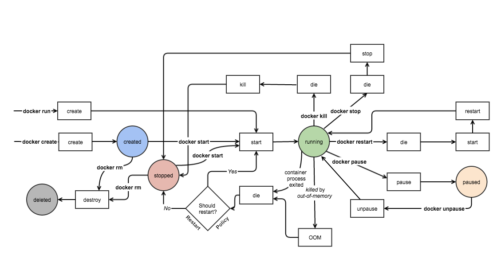

# Container Lifecycle

## Stages

A Docker container lifecycle consists of various stages, from creation to termination. The primary stages include creating, starting, stopping, and killing a container. Additionally, Docker containers can use volumes to persist and share data between containers and the host system. Here is an overview of these stages and the role of volumes in the container lifecycle:

1. Created state
1. Running state
1. Paused state/unpaused state
1. Stopped state
1. Killed/Deleted state


### Created state

The very first state in the lifecycle, a docker container is created from a docker image.
At this stage, the container is created but not running. Docker allocates a unique ID and a writable layer for the container, and any specified volumes are also created and mounted.

```sh
docker create --name <name-of-container> <docker-image-name>
```

### Running state

In the running state, the docker container starts executing the commands mentioned in the image. To run a docker container, use the docker run command.

```sh
docker run <container-id / container name>
```

### Paused state

So, as the container is running, there must be a way to pause it. We can do so by running the pause command. This command effectively freezes or suspends all the processes running in a container using the `SIGSTOP` signal. When in a paused state, the container is unaware of its state. The memory of the container still persists and is once again available when the container processes resumes using the Docker unpause command.

```sh
docker pause <container-id / container name>
```

In the unpaused state, the paused container resumes executing the commands once it is unpaused. <br/>
Then, Docker sends the `SIGCONT` signal to resume the process.

```sh
docker unpause <container-id / container name>
```

### Stopped state

When we invoke the Docker Stop command on a container, the daemon invokes the `SIGTERM` signal to the main process of the container and then invokes the `SIGKILL` signal. The entire memory of the container is released.

```sh
docker stop <container-id>
```

### Killed state

You can kill a running container using the docker kill command, which immediately sends a SIGKILL signal to the main process, forcibly terminating the container without allowing for a graceful shutdown. It's typically used when a container is unresponsive or in scenarios where a quick termination is necessary.

```sh
docker kill <container-id>
```

> [!NOTE]  
> The difference between docker stop and docker kill is that - stop can allow safe termination (within the grace period) while kill terminates immediately.

### Deleted state

A container that is in the created state or stopped can be removed with docker rm. This will result in the removal of all data associated with the container like the processes, file system, volume & network mappings, etc.

```sh
docker rm <container-id>
```



## Data Persistence

By default all files created inside a container are stored on a writable container layer. This means that:

- The data doesn’t persist when that container no longer exists, and it can be difficult to get the data out of the container if another process needs it.
- A container’s writable layer is tightly coupled to the host machine where the container is running. You can’t easily move the data somewhere else.

### Docker Volumes

Volumes are the preferred mechanism for persisting data generated by and used by Docker containers. They are independent of the container lifecycle, which means the data in a volume remains intact even if the associated container is stopped, killed, or removed.

No matter which type of mount you choose to use, the data looks the same from within the container. It is exposed as either a directory or an individual file in the container’s filesystem.

An easy way to visualize the difference among volumes:


#### Volumes

Created and managed by Docker. You can create a volume explicitly using the docker volume create command, or Docker can create a volume during container or service creation.

When you create a volume, it is stored within a directory on the Docker host. When you mount the volume into a container, this directory is what is mounted into the container. This is similar to the way that bind mounts work, except that volumes are managed by Docker and are isolated from the core functionality of the host machine.

A given volume can be mounted into multiple containers simultaneously. When no running container is using a volume, the volume is still available to Docker and is not removed automatically. You can remove unused volumes using docker volume prune.

When you mount a volume, it may be named or anonymous. Anonymous volumes are not given an explicit name when they are first mounted into a container, so Docker gives them a random name that is guaranteed to be unique within a given Docker host. Besides the name, named and anonymous volumes behave in the same ways.

Bind mounts may be stored anywhere on the host system. They may even be important system files or directories. Non-Docker processes on the Docker host or a Docker container can modify them at any time.

tmpfs mounts are stored in the host system’s memory only, and are never written to the host system’s filesystem.

#### Mounts

Available since the early days of Docker. Bind mounts have limited functionality compared to volumes. When you use a bind mount, a file or directory on the host machine is mounted into a container. The file or directory is referenced by its full path on the host machine. The file or directory does not need to exist on the Docker host already. It is created on demand if it does not yet exist. Bind mounts are very performant, but they rely on the host machine’s filesystem having a specific directory structure available. If you are developing new Docker applications, consider using named volumes instead. You can’t use Docker CLI commands to directly manage bind mounts.

#### Tmpfs mounts

A tmpfs mount is not persisted on disk, either on the Docker host or within a container. It can be used by a container during the lifetime of the container, to store non-persistent state or sensitive information. For instance, internally, swarm services use tmpfs mounts to mount secrets into a service’s containers.

### More about volumes

#### Volume advantages

Volumes have several advantages over bind mounts:

- Volumes are easier to back up or migrate than bind mounts.
- You can manage volumes using Docker CLI commands or the Docker API.
- Volumes work on both Linux and Windows containers.
- Volumes can be more safely shared among multiple containers.
- Volume drivers let you store volumes on remote hosts or cloud providers, to encrypt the contents of volumes, or to add other functionality.
- New volumes can have their content pre-populated by a container.
- Volumes on Docker Desktop have much higher performance than bind mounts from Mac and Windows hosts.

#### Volume use cases

Sharing data among multiple running containers. If you don’t explicitly create it, a volume is created the first time it is mounted into a container. When that container stops or is removed, the volume still exists. Multiple containers can mount the same volume simultaneously, either read-write or read-only. Volumes are only removed when you explicitly remove them.

When the Docker host is not guaranteed to have a given directory or file structure. Volumes help you decouple the configuration of the Docker host from the container runtime.

When you want to store your container’s data on a remote host or a cloud provider, rather than locally.

When you need to back up, restore, or migrate data from one Docker host to another, volumes are a better choice. You can stop containers using the volume, then back up the volume’s directory (such as /var/lib/docker/volumes/`<volume-name>`).

When your application requires high-performance I/O on Docker Desktop. Volumes are stored in the Linux VM rather than the host, which means that the reads and writes have much lower latency and higher throughput.

When your application requires fully native file system behavior on Docker Desktop. For example, a database engine requires precise control over disk flushing to guarantee transaction durability. Volumes are stored in the Linux VM and can make these guarantees, whereas bind mounts are remoted to macOS or Windows, where the file systems behave slightly differently.