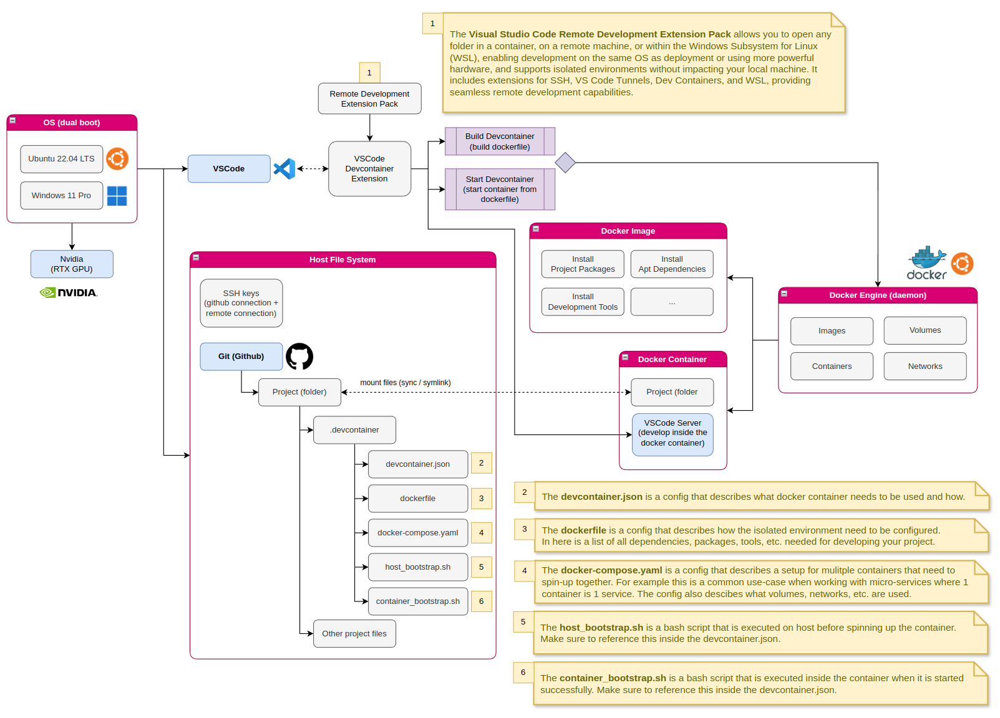

# Docker Dev Containers

## What is Docker Dev Container?

A Docker Dev Container, or Development Container, is a feature of Visual Studio Code that allows developers to define their development environment inside a Docker container. This ensures a consistent development environment across different machines and developers, reducing the "it works on my machine" problem. With the help of a devcontainer.json configuration file, you can define the Docker image, extensions, and settings needed for your project.

## Why use Docker Dev Containers?

There are several reasons to use Docker Dev Containers:

- **Consistent Development Environment**: By defining the entire development environment within a container, you ensure that all developers work with the same tools, libraries, and configurations, regardless of their local machine setup.

- **Isolation**: Docker containers provide isolation, which means that your development environment is separated from your local machine. This reduces conflicts between projects and makes it easy to switch between different projects with distinct dependencies and configurations.

- **Reproducibility**: Since the development environment is defined in code, it can be version-controlled and shared with other developers, ensuring that everyone is using the same environment and making it easier to reproduce and fix issues.

- **Easier Onboarding**: New team members can get started quickly by simply running the Docker container. They won't need to manually install and configure development tools or worry about compatibility issues with their local machine.

- **Cross-Platform Compatibility**: Docker Dev Containers work on Windows, macOS, and Linux, making it easy for developers to collaborate on projects regardless of their operating system.

## How to use Docker Dev Containers

Here an overview of the devcontainers concept:



To get started with Docker Dev Containers, follow these steps:

1. **Install prerequisites**: Make sure you have the following tools installed on your machine:

- Docker Desktop (Windows or macOS) or Docker Engine (Linux). See info [here](/docs/engineering/docker/docker_install.md)
- Visual Studio Code With Extensions
  - See what to install at [VSCode-Extentions-RemoteDevelopment](../ide/vscode/extensions.md) 

1. **Create a Dockerfile**: In your project directory, create a Dockerfile that defines the base image, tools, libraries, and configurations needed for your development environment.

2. **Create a devcontainer.json file**: In your project directory, create a .devcontainer folder and a devcontainer.json file within it. This file will define the settings for your Dev Container, such as the Docker image, required extensions, and other settings.

Example devcontainer.json file:

```json
{
	"name": "linux.dev.docs",
	"dockerComposeFile": "docker-compose.yml",
	"service": "devcontainer",
	"workspaceFolder": "/workspace",
	"postCreateCommand": "cd /workspace/docusaurus && npm install",
	"customizations": {
		"vscode": {
			"extensions": [
				"mhutchie.git-graph"
			]
		}
	}
}
```

Example of the docker-compose.yml:

```yaml
version: '3.8'
services:
  devcontainer:
    user: dev
    build: 
      context: ../.. # git repo root is the context folder
      dockerfile: .devcontainer/dev/Dockerfile
    pull_policy: if_not_present
    stdin_open: true # docker run -i
    tty: true        # docker run -t
    volumes:
      - ../..:/workspace # specifies git repo root
```

Example of the Dockerfile:

```shell
FROM ubuntu:22.04

ENV NPM_CONFIG_LOGLEVEL=warn
ENV NPM_CONFIG_COLOR=false

# General APT packages
RUN \
    apt -qq update && \
    apt -qq install -y \
        curl \
        sudo \
        gnupg \ 
        build-essential \
        git

# Install Nodejs & npm
RUN curl -sL https://deb.nodesource.com/setup_18.x -o nodesource_setup.sh && \
    sudo bash nodesource_setup.sh && \
    sudo apt install nodejs

# Verify that Node.js has been installed
RUN node -v
RUN npm -v

# Create User
RUN useradd -u 1000 dev && \
    echo "dev:dev" | chpasswd && \
    adduser dev sudo && \
    mkdir -p /home/dev && \
    chown -R dev /home/dev && \
    printf "\ndev ALL=(ALL) NOPASSWD: ALL" >> /etc/sudoers
    
ENV USER=dev \
    PATH=/home/dev/.local/bin:$PATH 

USER dev
WORKDIR /home/dev
```

4. **Open your project in the Dev Container: In Visual Studio Code**, open the Command Palette (**Ctrl+Shift+P** or Cmd+Shift+P) and run the "**Dev-Containers: Open Folder in Container...**" command. Select your project folder, and Visual Studio Code will build and start the Docker container based on your Dockerfile and devcontainer.json.

5. **Start developing**: Once the container is running, you can use Visual Studio Code to edit, build, and debug your project inside the Dev Container.

## WSL

When using vs code and wsl you can open a project but with using different steps:

### Via WSL

1. Open WSL
2. Via the terminal, git clone the project in ~/git
3. Go into the directory of the project
4. Use the following command to open the project with vscode using wsl `code .`
5. VS Code will open with a connection to WSL (see left bottom corner)
6. Open command palette and run "**Dev Containers: Rebuild and ReOpen in Container**"

### Via VS Code

1. Open VS Code
2. Open command palette and run "**WSL: Connect to WSL using Distro...**"
3. Select the distro you want to use (Ubuntu LTS). This will connect VS Code to WSL
4. git clone (via ssh) the project in ~/git via the VS Code terminal (ctrl+j)
5. Open the folder with VS Code:
   - Via file icon >> open folder
   - Or via VS Code terminal (ctrl+j) >> go to directory >> enter command `code .`
6. Open command palette and run "**Dev Containers: Rebuild and ReOpen in Container**"