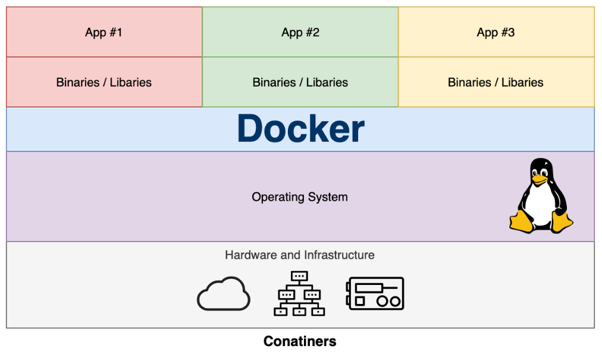

# Docker Overview

## Welcome To Docker

### What is docker?

Docker is a set of platform as a service (PaaS) products that use OS-level virtualization to deliver software in packages called containers. By encapsulating applications and dependencies within containers, Docker can help to address many of the pain points that developers, operators, and enterprises face when building and deploying software.

### What is a container?

A container is a lightweight, standalone, and executable package that includes everything needed to run an application, including the code, libraries, dependencies, and configuration files. Containers provide a consistent and isolated runtime environment for applications, enabling them to run consistently across different environments.

Containerisation is increasingly popular because containers are:

- **Flexible**: Even the most complex applications can be containerised.

- **Lightweight**: Containers leverage and share the host kernel, making them much more efficient in terms of system resources than virtual machines.

- **Portable**: You can build locally, deploy to the cloud, and run anywhere.

- **Loosely coupled**: Containers are highly self sufficient and encapsulated, allowing you to replace or upgrade one without disrupting others.

- **Scalable**: You can increase and automatically distribute container replicas across a datacenter.

- **Secure**: Containers apply aggressive constraints and isolations to processes without any configuration required on the part of the user.

Containers are based on the concept of operating system-level virtualization, which enables multiple isolated user-space instances to share the same kernel. This approach provides a lightweight and efficient way to run applications, as containers can be started and stopped quickly, and require less overhead than traditional virtual machines.

### Developing Without Docker

Without Docker, developers and operators face several pain points when building, deploying, and managing applications. Some of these challenges include:

- **Inconsistent environments**: Without Docker, it's common for developers to encounter issues when moving applications between environments, such as from development to testing or production. Differences in configurations, dependencies, and underlying infrastructure can lead to the well-known "it works on my machine" problem, resulting in wasted time and effort to identify and resolve discrepancies.

- **Long deployment times**: Without Docker, setting up and configuring environments for applications can be time-consuming, as it often involves manual processes and coordination between development and operations teams. Docker enables faster deployment times by automating and streamlining the process of packaging and deploying applications.

- **Dependency management**: Managing dependencies for applications can be a complex task, especially when dealing with multiple versions of libraries or frameworks needed by different applications. Without Docker, it can be challenging to ensure that each application has the correct version of its dependencies without interfering with others.

- **Resource utilization**: Traditional virtualization solutions, like virtual machines (VMs), have higher overhead and consume more resources, as each VM runs a full operating system along with the application. Docker containers are more lightweight, enabling better resource utilization and allowing more containers to run on the same host compared to VMs.

- **Difficulty in scaling**: Scaling applications without Docker can be a complex and error-prone process, as it may require manual intervention to provision additional resources, configure load balancers, and manage dependencies. Docker simplifies scaling by providing a consistent environment and built-in tools for managing containerized applications, such as Docker Swarm and Kubernetes.

- **Limited visibility**: Without Docker, it can be difficult to gain visibility into the health and performance of applications across different environments, which can make it challenging to identify and address issues quickly. Isolation makes it possible to run multiple containers on the same host machine without conflicts, and enables developers and operators to package and deploy applications more easily and efficiently.

- **Security concerns**: Running applications without proper isolation can expose them to security risks, as a vulnerability in one application could potentially affect others running on the same host. Docker provides an isolated environment for each container, reducing the potential attack surface and limiting the impact of security issues.

### Docker images and containers

A **Docker image** is a lightweight, standalone, and executable package that includes everything needed to run an application, including the code, libraries, dependencies, and configuration files. Images are created using a Dockerfile, which defines the instructions needed to build the image. Once an image is built, it can be stored in a registry, such as Docker Hub or a private registry, and can be pulled down to any environment where it needs to be run.

A **Docker container** is a running instance of a Docker image. Containers provide a lightweight and isolated runtime environment for applications, enabling them to run consistently across different environments. Each container runs in its own isolated environment, with its own file system, networking, and resources, and can be started, stopped, or deleted as needed. Containers are created using a Docker image, which defines the contents and configuration of the container. 

## Dedicated Hosts, Virtual Machines and Docker

As you can see, for a dedicated machine, we have three applications, all sharing the same orange software stack. Running virtual machines allows us to run three applications, running two completely different software stacks. 

The following diagram shows the same three applications running in containers using Docker:

This diagram gives us a lot of insight into the most significant key benefit of Docker,
that is, there is no need for a complete operating system every time we need to bring
up a new container, which cuts down on the overall size of containers. Since almost all
the versions of Linux use the standard kernel models, Docker relies on using the host
operating system's Linux kernel for the operating system it was built upon, such as Red
Hat, CentOS, and Ubuntu.

For this reason, you can have almost any Linux operating system as your host operating system and be able to layer other Linux-based operating systems on top of the host. Well, that is, your applications are led to believe that a full operating system is actually installed but in reality, we only install the binaries, such as a package manager.

Another benefit of Docker is the size of images when they are created. They are built without the most significant piece: the kernel or the operating system. This makes them incredibly small, compact, and easy to ship.

## Docker Teminology

### Docker Hub

A Docker _registry_ stores Docker images. Docker Hub is a public registry that anyone can use. A community resource for working with Docker that is hosted in the cloud. Docker Hub is mostly used for hosting images, but it is also used for user authentication and image-building automation. Anyone can upload images to Docker Hub for free. Individuals or organizations who contribute images to Docker Hub are not checked or verified in any way. 

### Docker Store

Docker Store is a cloud-based repository comparable to Docker Hub, except that the images on Docker Store have been contributed by commercial businesses that Docker has approved or certified.

### Docker Engine / Daemon

Docker engine is the core component of the Docker platform, and it is responsible for creating and managing Docker containers. Docker engine is a lightweight runtime that can run on a variety of platforms, including Linux, Windows, and macOS. It provides an API and a command-line interface for managing Docker containers, images, and networks. Docker engine is typically used in production environments, where it can be deployed on servers to run and manage Docker containers.

Docker engine is also referred as `docker daemon`.

### Docker Desktop

Docker Desktop is a desktop application for building and testing Docker images and containers on a developer's local machine. It includes Docker engine, along with a graphical user interface and a set of tools for building, testing, and deploying Docker containers. Docker Desktop is available for Windows and macOS and provides an easy-to-use interface for managing Docker images and containers on a developer's local machine.

### Docker File

A text file with the commands for creating a Docker image. The commands you can specify in a Dockerfile range from sophisticated (such as specifying an existing image to use as a base) to basic (such as specifying an existing image to use as a base) (such as copying files from one directory to another).

For example, you could make a Dockerfile that starts with the Ubuntu image and then adds the Apache web server, your application, and any other configuration parameters you need. The docker build command is used to create an image from a Dockerfile.

### Docker Compose

Docker Compose is a tool for defining and running multi-container Docker applications. It allows developers to define their application as a set of services, each running in its own container, and to configure the networking and dependencies between the services. Docker Compose provides a simple YAML file format for defining the services and their configuration, and it can be used to start, stop, and manage the containers that make up the application.

### Docker Swarm

Docker Swarm is a native clustering and orchestration platform for Docker, allowing you to create, deploy, and manage multi-container applications across multiple hosts. It transforms a group of Docker nodes into a coordinated and self-healing cluster, providing built-in support for load balancing, service discovery, scaling, and fault tolerance.

### Docker Sandbox

In Docker terminology, a "sandbox" refers to the isolated environment created by a Docker container. When a Docker container is started, it is launched in its own sandboxed environment, which is completely isolated from the host machine and other containers running on the same machine.

This sandboxed environment provides a secure and reliable way to run applications, without worrying about conflicts with other processes or dependencies on the host machine. Each container has its own isolated file system, network stack, and process space, and can run with specific resource constraints and security settings.

Docker also provides additional sandboxing features, such as the ability to limit container access to specific devices, restrict network traffic, and enforce CPU and memory usage limits.

## Docker Dev Container vs Docker Dev Environment

### Docker Dev Container

A **Docker dev container** typically refers to a Docker container that is specifically configured for local development. It is designed to provide a consistent, isolated, and reproducible environment for building and testing applications. Developers can use a Docker dev container to ensure that their application runs consistently across different development machines and environments.

Developers can install and configure any necessary dependencies, such as databases, web servers, and libraries, as well as any tools or editors they prefer to use for development. The Dockerfile used to build the dev container can also include any customizations or configurations needed for the specific project.

Example:

A developer is building a Python application that requires a specific version of the Python interpreter and a set of libraries. To ensure a consistent development environment, the developer creates a Docker dev container that includes the required Python version and libraries. The container is used for local development and testing, and can be easily shared with other team members.

### Docker Dev Environment

A **Docker dev environment** can refer to a broader concept that encompasses multiple Docker containers and other tools and services needed for local development. In addition to the Docker dev container, a Docker dev environment may include other tools such as an IDE or editor, a version control system, a continuous integration and deployment (CI/CD) system, and other tools for testing, debugging, and monitoring the application.

A Docker dev environment can be configured to mimic the production environment as closely as possible, allowing developers to test their application under realistic conditions before deploying it to production. By using Docker to create a dev environment, developers can ensure that the environment is consistent across different machines and can be easily shared with other team members.

Example:

A team of developers is working on a web application that uses a microservices architecture. The application is composed of multiple services that communicate with each other using a messaging system. To develop the application locally, each developer needs to run multiple containers that provide the messaging system, the web server, and other services. To simplify the development workflow, the team creates a Docker dev environment that includes all the required containers, as well as an IDE, a version control system, and a CI/CD system. Each developer can then use the dev environment to work on their part of the application, test it locally, and integrate their changes with the rest of the team.

## Python Virtual Environment vs Docker Container

Python virtual environments and Docker containers are both tools that can be used to create isolated environments for Python development, but they have some important differences.

Python virtual environments are used to create isolated environments for Python development within a single machine. They allow developers to install and use specific versions of Python and Python packages without affecting other Python installations on the machine. Virtual environments are typically created using tools like venv, virtualenv, or conda, and can be activated or deactivated as needed.

Docker containers, on the other hand, provide a more complete level of isolation for development environments. They create an entire runtime environment that includes not only Python and Python packages, but also any other dependencies required by the application, such as databases, web servers, or other services. Docker containers are designed to be run on any machine that supports Docker, which means that they can provide a consistent development environment across different platforms and operating systems.

Here are some key differences between Python virtual environments and Docker containers:

**Isolation**: 
Python virtual environments isolate Python and Python packages, but do not isolate other dependencies or services required by the application. 
Docker containers provide a more complete level of isolation, and can isolate not only Python and Python packages, but also other dependencies and services.

**Consistency**: 
Python virtual environments ensure consistency within a single machine, but may not provide consistency across different machines or operating systems. 
Docker containers are designed to provide Developers, Operators and Enterprises with consistent development environments across diexplfferent platforms and operating systems.

**Portability**: 
Python virtual environments can be easily shared and transferred between developers, but may require additional setup and configuration on different machines. 
Docker containers are designed to be easily shared and transferred between different machines, and require little to no additional setup or configuration.

**Resource usage**: 
Python virtual environments consume fewer resources than Docker containers, since they only isolate Python and Python packages. 
Docker containers may require more resources, since they isolate not only Python and Python packages, but also other dependencies and services.

