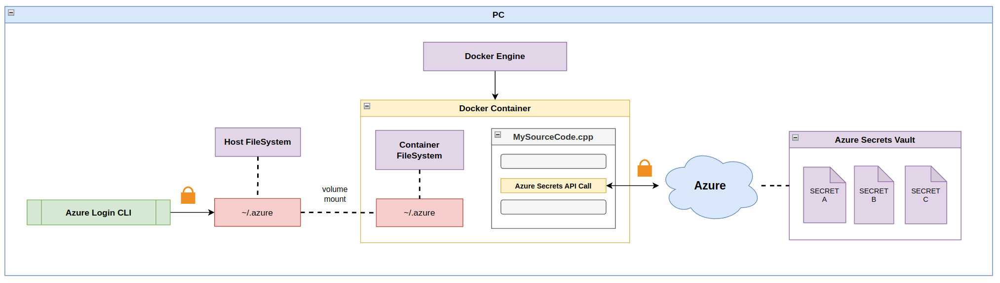

# Docker Secrets

## What Are Secrets?

Secrets, in the context of computing and data security, refer to any piece of confidential or sensitive information that should be kept private and protected from unauthorized access. They typically include sensitive data such as passwords, API keys, encryption keys, database credentials, tokens, certificates, and other types of privileged information.

The importance of managing secrets effectively when working with sensitive data cannot be overstated. Here are key reasons why secrets management is crucial:

**Security**: Secrets contain valuable and sensitive information that, if exposed, can lead to unauthorized access, data breaches, identity theft, or other malicious activities. Proper secrets management ensures the confidentiality and integrity of sensitive data, reducing the risk of security incidents.

**Access control**: Secrets management enables organizations to implement proper access controls, ensuring that only authorized individuals or services have the necessary privileges to access sensitive data. It helps enforce the principle of least privilege and restricts access to sensitive resources on a need-to-know basis.

**Secure deployments**: When deploying applications or services, secrets are needed to authenticate with external systems, access secure resources, or establish secure communication channels. Proper secrets management ensures that these credentials are securely stored, protected, and only accessible to the intended applications or services.

**Rotation and revocation**: Secrets have a lifespan, and it is essential to periodically rotate and revoke them to minimize the risk of compromise. Effective secrets management facilitates the timely rotation of credentials, ensuring that any leaked or compromised secrets are rendered useless.

**Audit and accountability**: Secrets management provides an audit trail and logging capabilities, allowing organizations to track and monitor the usage and access to sensitive data. It helps identify any suspicious activities, investigate security incidents, and maintain accountability.

## Creating A Secret

> [!CAUTION]
> Creating secrets using the docker engine can only be done when your docker engine is init as a swarm node.     

We can create a secret using the secret create command which has two parameters: the name of the secret and the secret itself.

```shell
echo "Secret" | docker secret create <secret-name> -
```

After creating the secret you can inspect it or display all secrets that are available on your machine.

```shell
# List all secrets
docker secret ls

# Inspect a specific secret
docker inspect <secret-name>
```

Lastly, you can remove a secret using the secret rm command.

```shell
docker secret rm my_secret
```

## Passing A Secret To A Service

Secrets can be added to services on creating or while the containers are running using the following commands.
The `--secret` tag can be used to add a secret while creating a service.

```shell
docker service create --name="<service-name>" --secret="<secret-name>" <image-name>
```

Adding and removing secrets from running services can be done using the --secret-add and --secret-rm tags on the service update command.

```shell
docker service update --secret-rm="<secret-name>" <service-name>
```

## Secrets Usage Types

### Hardcoding Your Secret

Hardcoding your secret involves directly embedding the sensitive information within your Dockerfile or application code. Although this method is straightforward, it is generally discouraged due to security risks


#### Pros

- **Simplicity**: Hardcoding secrets is easy and straightforward to implement.
- **No additional setup**: There is no need for additional configuration or tooling.

#### Cons

- **Security risk**: Hardcoded secrets can be easily exposed if the code or configuration files are accessed.
- **Lack of flexibility**: Changing the secret requires modifying the code or configuration files and rebuilding the image.

### Referencing Environment Variable

Referencing an environment variable allows you to store the secret value outside your application code or Dockerfile, improving security and flexibility.
The env variable is passed with a `docker run` command in the CLI.


#### Pros

- **Better than hardcoding secrets in the source code**: While referencing environment variables is considered a better practice than hardcoding secrets in the source code, it still presents security risks and is a less secure approach overall. 
- **Separation of concerns**: Secrets are stored outside the codebase, promoting better security and maintainability.
- **Flexibility**: Environment variables can be easily updated without modifying the code or rebuilding the image.
- **Widely supported**: Environment variables are a standard feature across different platforms and tools.

#### Cons

- **Lack of permission control**: Environment variables do not provide fine-grained permission controls for accessing or modifying secrets. Any process running in the container or with access to the environment variables can potentially read or modify them without restrictions.
- **Possibility of looking up all environment variables**: In certain scenarios, it may be possible to list or access all environment variables within a container or host. This can potentially expose sensitive information if proper access controls and security measures are not in place.
- **Visibility of secrets in Portainer**: Portainer, a popular Docker management GUI, may display environment variables and their values, including secrets, in its user interface. This can pose a security risk if unauthorized users gain access to the Portainer interface, potentially exposing sensitive information.
- **Exposed CLI history**: When passing environment variables as arguments from the command line interface (CLI), there is a risk of exposing sensitive information if the command history is logged or visible to other users. Care should be taken to ensure that the command history does not store or display the sensitive values.
- **Lack of encryption**: Environment variables are often stored in plain text, which may pose a security risk if unauthorized access to the container or host occurs.
- **Scalability challenges**: Managing and updating environment variables across a large number of containers or services can become challenging and error-prone.
- **Lack of version control**: Environment variables are not typically version controlled, making it difficult to track changes and revert to previous versions if needed.
- It is possible to just lookup all the environment variables (= not secure): In some cases, it may be possible to list or access all the environment variables within a container or host. This can potentially expose sensitive information if proper access controls and security measures are not in place.

### Referencing Environment Variable Using Docker Compose

Docker Compose provides a simple way to manage and reference environment variables when using multiple containers.


#### Pros

- **Centralized configuration**: Docker Compose allows managing environment variables across multiple containers in a single file.
- **Simplicity and flexibility**: Docker Compose enables straightforward modification and updating of environment variables without the need to modify the underlying code or rebuild the image.
- **Improved portability**: Environment variables defined in Docker Compose can be easily replicated across different environments and deployments, ensuring consistent configuration.

#### Cons

- **Secrets stored in source control**: As Docker Compose is a file-based configuration, the secret values specified in the Docker Compose file can be stored in source control, potentially exposing them to unauthorized access or compromise.
- **Lack of encryption**: Environment variables are often stored in plain text, which may pose a security risk if unauthorized access to the container or host occurs.
- **Lack of permission control**: Docker Compose does not provide fine-grained permission controls for accessing or modifying secrets. Any process running in the container or with access to the environment variables can potentially read or modify them without restrictions.
- **Visibility of secrets in Portainer**: Portainer, a popular Docker management GUI, may display environment variables and their values, including secrets, in its user interface. This can pose a security risk if unauthorized users gain access to the Portainer interface, potentially exposing sensitive information.

### Using Docker Secrets (via files)

While Docker Secrets is primarily designed for Docker Swarm, you can also use Docker Secrets with Docker Compose. These secrets are defined directly in the Docker Compose file. The content of the secret is the content of a file that is copied into the Docker swarm's "secrets" location.


#### Pros

- **Ease of use**: File-based secrets are easier to set up because they're defined directly in the Docker Compose file. There's no need to use the command line to create the secrets beforehand.

#### Cons

- **Portability**: Since the secret content is stored in a file, it's easy to version control which is not good when working with sensitive data. Make sure to `.gitignore` these!
- **Security concerns**: Storing secrets in files may expose them to unintended access if the security of the file itself is not appropriately handled. This issue becomes critical when the file is stored in a version control system like Git.
- **Manual Management**: Updating or rotating the secrets requires manually updating the files and reloading the services, which might not be practical in production environments.
- **Lack of Auditability**: With file-based secrets, it's harder to monitor or track who has accessed the secrets, limiting the auditability.

### Using Docker Secrets (via swarm)

These secrets are not defined directly in the Docker Compose file but are created separately using Docker's command-line tools and then referenced in the Docker Compose file.


#### Pros

- **Security**: Since external secrets are not stored in files, they do not pose the risk of being exposed through file-based access. They are stored in Docker's internal secrets storage, which automatically encrypts the secrets at rest.
- **Flexibility**: External secrets can be managed independently from Docker Compose, allowing you to update or rotate secrets without having to change anything in your Docker Compose file.
- **Automation**: External secrets are suitable for automated secret rotation mechanisms, which can be essential in a production environment.

#### Cons

- **Complexity**: Setting up external secrets requires using Docker's command-line interface, which might be more complicated than defining the secrets directly in the Docker Compose file.
- **Portability**: External secrets make your Docker Compose setup less portable, as the secrets must be set up separately on every environment where you want to deploy your application.

> [!NOTE]  
> While file-based secrets might be a good option for development or small projects due to their simplicity and portability, external secrets are generally a better choice for production environments due to their improved security and flexibility.

### Using Secrets Via Azure Secrets Vault API

Azure Key Vault is a cloud service provided by Microsoft that securely stores and tightly controls access to secrets, keys, and certificates. Azure Key Vault's Secrets Vault API can be used to manage and access these secrets programmatically.



#### How To Use

1. **Create an Azure Key Vault**: First, you need to create an Azure Key Vault instance in your Azure account.
1. **Add Secrets to the Vault**: Once the vault is created, you can add secrets to it. Each secret is simply a key/value pair that you can store.
1. **Access Secrets via API**: After your secrets are stored in the vault, you can access them programmatically using the Secrets Vault API. You will need to authenticate using Azure's Identity and Access Management, which can provide your application with an access token. The access token can then be used to make API calls to access your secrets.

#### Pros

- **Centralized management**: Secrets are stored and managed centrally within the Azure Secrets Vault, providing a unified and scalable solution for secret management across multiple applications and environments.
- **Security**: Azure Key Vault uses industry-standard algorithms and key lengths, which makes it a very secure solution for storing secrets. It also provides secure access with Identity and Access Management (IAM).
- **Granular Access Control**: Azure Key Vault allows you to set granular permissions on your secrets, letting you control exactly who has access to what.
- **Auditing and Monitoring**: Azure Key Vault provides logging and monitoring capabilities, which can help you keep track of who is accessing your secrets and when.
- **Secrets Rotation**: Azure Key Vault supports automatic secrets rotation, which can enhance the security of your applications.

#### Cons

- **Cost**: Azure Key Vault is a paid service, so you'll need to take the cost into account when deciding whether to use it.
- **Complexity**: Setting up and using Azure Key Vault can be complex, especially if you're not already familiar with Azure services.
- **Vendor Lock-in:** If you store your secrets in Azure Key Vault, you're tying your application more closely to Azure. If you decide to move your application to another cloud provider in the future, you'll need to migrate your secrets as well.
- **Availability**: Azure Key Vault's availability is tied to Azure's uptime. If Azure experiences a service disruption, you may temporarily lose access to your secrets.

## Using Secrets During Docker Build

### Mount Secrets In Docker Build


Mounting a secret in the Docker build process, specifically when using Docker BuildKit, can be beneficial for a variety of reasons. Let's break them down:

1. **Push the secret to a .txt file** on the local host machine.
2. **Mount the secret (.txt) in the docker-compose.yaml in the build process**. 
   - In the dockerfile, at the beginning of a RUN definition, add a `--mount=type=secret,id=mysecret` to mount the secret in this RUN.
   - Now it can be used inside the  to login to private resources (for example a package manager).
3. **Run the docker image**, the packages will be installed and are ready to use.

#### Benefits of using this method

- **Safety and Security**: One of the primary benefits of mounting secrets in the build process is that it allows for sensitive information to be used in the build without it being included in the Docker image or cached layers. This is crucial because Docker images are often distributed and run across different environments, and including sensitive information like API keys, database credentials, or private keys in the image could expose these secrets to unauthorized individuals. With Docker BuildKit, you can use the --mount=type=secret option to mount a file as a secret during the build process. The secret is not included in the image or in the Docker layer cache, and it is removed after the build step is completed. This ensures that the secret data is only available during the build and not afterwards, enhancing the security of your Docker images.

- **Access to Private Resources**: Another use case for mounting secrets is when your build process needs access to private resources, such as private package managers or repositories. For instance, you might need to authenticate with a private npm registry or a private Python PyPI server to download and install certain packages. In these cases, you can mount the necessary authentication tokens or credentials as secrets during the Docker build, allowing your Dockerfile instructions to authenticate with the private resource and access the necessary packages. Again, because these secrets are not included in the final Docker image or cached layers, you can safely distribute the resulting Docker image without worrying about exposing your private credentials.

> [!CAUTION]
> Make sure add the secret to the **.gitignore** because this can never be part of source control!

### Get Secrets From Azure Key Vault

Using Azure Key Vault in combination with Docker BuildKit can indeed be very handy, especially when managing sensitive data like secrets, keys, and certificates. Azure Key Vault is a cloud service for securely storing and accessing secrets. A secret is anything that you want to tightly control access to, such as API keys, passwords, or certificates.


Here's a step-by-step breakdown of the process:

1. **Azure Login**: The az login command is used to sign in to your Azure account in the command line. This command opens a browser window where you can sign in with your Azure account credentials. After successful authentication, your command line session will be linked to your Azure account.

2. **Get Access Token**: The az account get-access-token command is used to get an access token and other information like the subscription and tenant IDs. The access token is a kind of "key" that Azure uses to confirm that you have permission to access resources in your account.
   - The access token will only be valid for max 60 min. 

3. **Retrieve Secrets from Azure Key Vault**: The az rest command allows you to send HTTP requests to Azure REST APIs. This can be used to retrieve secrets from the Azure Key Vault by sending a GET request to the correct endpoint. The response will include the secret value.

4. **Copy Secret into File**: After retrieving the secret, you can copy it into a file on your local system. This file will be used in the Docker build process. Be sure to handle this file securely, as it contains sensitive data. For instance, don't include it in your source control system.

5. **Use Secret in Docker Build**: When running docker build, you can use the --secret option to specify secrets to be available to the build process. For example, docker build --secret id=mysecret,src=/path/to/secret/file . This makes the secret available to the build but doesn't include it in the image or in any layer of the Docker build cache, thus maintaining the security of the secret.

6. **Run the docker image**