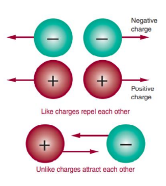
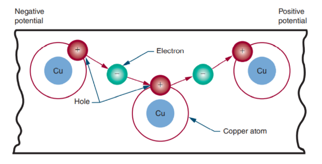
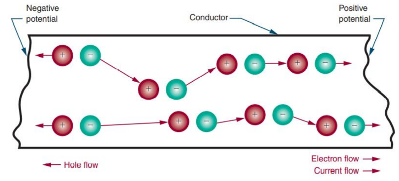
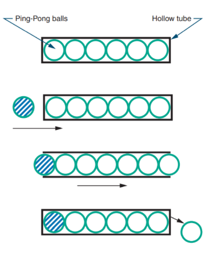

# Current

## Electric Charge 

Electric charge is a fundamental property of matter that determines how it interacts with other matter and electromagnetic fields. It's a bit like magnetic poles or the plus and minus signs on batteries, which create attraction and repulsion forces.

### Basic Charge Properties:

- **Negative Charge**: An object has a negative charge if it has more electrons than protons. Electrons are negatively charged particles.
- **Positive Charge**: An object is positively charged if it has more protons than electrons. Protons are positively charged particles.
- **Neutral Charge**: If an object has an equal number of protons and electrons, it is electrically neutral. Despite this neutrality, electrons are still in motion.

### Interaction of Charges:

When objects with different charges come close to each other, they can exert a force, attracting or repelling each other, just like magnets do.

- Like charges **repel** each other
- Unlike charges **attract** each other

## Flow of Electrons:

### Current

In electrical circuits and when dealing with static electricity, the flow of electrons is indeed typically from a negatively charged area to a positively charged area. This is because the negatively charged area has a surplus of electrons, and these electrons are attracted to the positively charged area where there is a lack of electrons. This flow of electrons is called **current**.

### Coulomb

When dealing with any two charged bodies or particles, the force between them (whether attraction or repulsion) depends on two main factors:
- **Their Charge**: More charge means a stronger force.
- **Distance Between Them**: The closer they are, the stronger the force. The force decreases rapidly as distance increases.

The standard unit for measuring electric charge is the **Coulomb** (symbol: `C`). It's a way of quantifying how much electric charge is present.

### 

Electrons, with their negative charge, represent the charge carrier in an electric circuit, because 
electrons jump from atom to atom. Therefore, electric current is the flow of negative charges.

As free electrons move slowly through the conductor, they collide with atoms, knocking other 
electrons free. These new free electrons travel toward the positive end of the conductor and collide 
with other atoms.

As electrons move from one atom to another, they create the appearance of a positive charge, 
called a hole.

The drift of electrons is slow (approximately an eighth of an  inch per second), but individual electrons ricochet off atoms, 
knocking other electrons loose, at the speed of light (186,000 miles per second). For example, visualize a long, hollow tube 
filled with Ping-Pong balls. As a ball is added to one end of the tube, a ball is forced out the other end of the tube. Although an individual ball takes time to travel down the tube, the speed of its impact can be far greater.

The device that supplies electrons from one end of a conductor (the negative terminal) and removes them from the other end 
of the conductor (the positive terminal) is called the **voltage source**. It can be thought of as a kind of pump.

## Current Flow:

- An electric current (`I`) consists of the drift of electrons from an area of negative charge to an area of positive charge. 
- The unit of measurement for current flow is the **ampere** (`A`). 
- An ampere represents the amount of current in a conductor when 1 coulomb of charge moves past a point in 1 second

**Formula**: `I = Q / t`    

Where: 
- `I` = current measured in amperes
- `Q` = quantity of electrical charge in coulombs
- `t` = time in seconds

1 coulomb = 1 ampere x 1 second

## Examples

### Example 1:

What is the current in amperes if 9 coulombs of charge flow past a point in an electric circuit in 3 seconds?

#### Given

- `I` = ?
- `Q` = 9 coulombs
- `t` = 3 seconds

#### Solution:

- `I = Q / t`
- `I = 9 / 3`
- `I = 3 amperes

### Example 2:

A circuit has a current of 5 amperes. How long does it take for 1 coulomb to pass a given point in the circuit?

#### Given:

- `I` = 5 amperes
- `Q` = 1 coulomb
- `t` = ?

#### Solution:

- `I = Q / t`
- `5 = 1 / t`
- `5 * t = 1` (cross-multiply)
- `t = 1 / 5`
- `t = 0.2 second`

