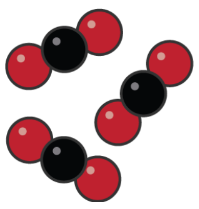
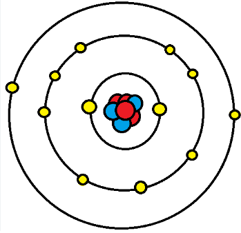
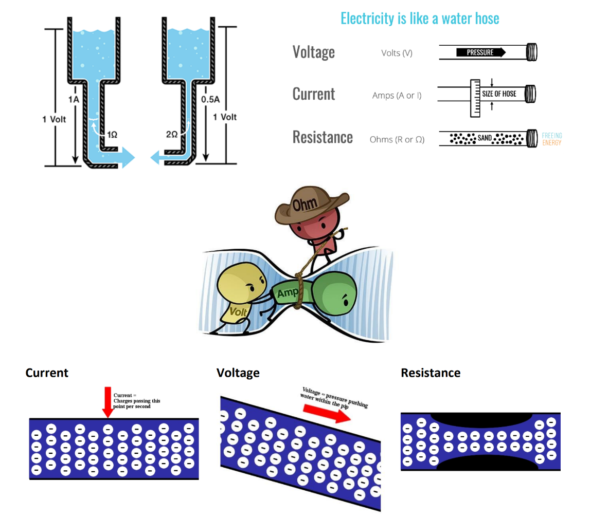

# Electricity To Its Atom

Everything, whether natural or artificial, can be broken down into either an element or a compound. 
However, the smallest part of each of these is the atom.

The atom is made up of protons, neutrons, and electrons. The protons and neutrons group together 
to form the center of the atom, called the nucleus. The electrons orbit the nucleus in shells located 
at various distances from the nucleus.

When appropriate external force is applied to electrons in the outermost shell, they are knocked 
loose and become free electrons. The movement of free electrons is called current. The external 
force needed to create this current is called voltage. As it travels along its path, the current 
encounters some opposition, called resistance.

## Matter, Elements and Compounds

### Matter

- Matter refers to anything that takes up space and has mass (weight). It can exist in three main states: solid, liquid, or gas.
- Examples of matter include the air we breathe, the water we drink, the clothes we wear, and even our own bodies.

### Element

- An element is the fundamental building block of nature.
- It is a pure substance that cannot be broken down into simpler substances using chemical methods.
- There are more than 100 known elements, each with its unique set of properties.
- Examples of elements include gold, silver, copper, and oxygen.

### Atom

- An atom is the smallest individual unit of an element.
- It retains all the distinctive properties of that particular element.
- Atoms are incredibly tiny and are made up of even smaller subatomic particles, such as protons, neutrons, and electrons.

### Molecule

- A molecule is the chemical combination of two or more atoms.
- Molecules can be composed of atoms of the same element (e.g., oxygen molecule, O2) or different elements (e.g., water molecule, H2O).
- Molecules are discrete entities and can exist independently.

### Compound

A compound is a type of molecule that consists of two or more different elements chemically bonded together in fixed ratios.
 
#### H2O

Water molecules are made up of two elements hydrogen (white atoms) and oxygen (red atoms).
Water has a specific ratio of two hydrogen atoms to one oxygen atom.

#### CO2

Carbon dioxide molecules are made up of two elements - carbon (black atoms) and oxygen (red atoms).
Carbon dioxide has a specific ratio is one carbon atom to two oxygen atoms.

## Mixture

- The physical combination of elements and compounds is called a mixture. 
- Examples of mixtures include air, which is made up of oxygen, nitrogen, carbon dioxide, and other gases. 
- Salt water consists of salt and water. This particle diagram shows a mixture made up of water and carbon dioxide.

- The water molecules each have two white hydrogen atoms and one red oxygen atom (H₂O).
- The carbon dioxide molecules each have one black carbon atom and two red oxygen atoms (CO₂).

## A Closer Look at Atoms

- Every atom has a nucleus. The nucleus is located at the center of the atom. 
- It contains positively charged particles called protons and uncharged particles called neu trons. 
- Negatively charged particles called electrons orbit around the nucleus.

The electrons orbit in concentric circles about the nucleus. 
Each orbit is called a **shell**. There are multiple shells around the nucleus which are in sequence to each other.

The outer shell is called the **valence shell**. The number of electrons it contains is the **valence**.

The farther the valence shell is from the nucleus, the less **attraction** the nucleus has on each valence 
electron. Thus the potential for the atom to gain or lose electrons increases if the valence shell is not 
full and is located far enough away from the nucleus.

**Conductivity** (measures how well a substance can allow the flow of electrical charges) of an atom depends on its valence band. The greater the number of electrons in the valence shell, the less it conducts. 
For example, an atom having seven electrons in the valence shell is less conductive than an atom having three electrons in the valence shell.

Electrons in the valence shell can **gain energy**. If these electrons gain enough energy from an 
external force, they can leave the atom and become free electrons, moving randomly from atom to 
atom.

Materials that contain a large number of free electrons are called **conductors.** 
Copper is a commonly used conductor in electrical wires and circuits due to its high conductivity.

**Insulators**, the opposite of conductors, prevent the flow of electricity. Insulators are stabilized by absorbing valence 
electrons from other atoms to fill their valence shells, thus eliminating free electrons.
Rubber is an insulator commonly used to insulate electrical wires and prevent electrical shocks.

Halfway between conductors and insulators are **semiconductors**. Semiconductors are neither good 
conductors nor good insulators but are important because they can be altered to function as 
conductors or insulators. 
Silicon is a widely used semiconductor material in electronic devices like transistors and microchips.

An atom that has the same number of electrons and protons is identified as an **electrically balanced atom**. 
A balanced atom that receives one or more electrons is no longer balanced. It is said to be 
negatively charged and is called a negative ion. A balanced atom that loses one or more electrons is 
said to be positively charged and is called a positive ion. The process of gaining or losing electrons is 
called **ionization**.

## Current, Voltage, Resistance

### Current 

**Analogy**: Imagine water flowing through a pipe. The electric current is like the amount of water flowing through the pipe. More water flow means a stronger current.

**Technical Explanation**: Electric current is the flow of electric charge, typically electrons, through a conductor (like a wire). It's measured in **amperes** (`A`), which indicates the number of charges passing a point per second. A higher current means more charges are flowing.

For many circuits, one whole amp is quite a large current, so you will see the units of **mA** (**milliamp**, a 
thousandth of an amp) a lot. 

### Voltage 

**Analogy**: Think of voltage as the pressure that pushes the water through the pipe. Higher pressure means the water can flow more forcefully.

**Technical Explanation**: Electromotive force (emf) or **Voltage**, measured in **volts** (`V`), is the electric potential difference between two points. It's the force that pushes the electric charges to move in a circuit. Higher voltage can push more current through a given resistance.

Voltage in electronics is created by an excess of electrons (negative charge) at one end of a conductor and a deficiency of electrons (positive charge) at the other end. This imbalance causes a current to flow between these two ends as long as it persists. The source that creates this imbalance is the **potential** or the capacity of the source to perform electrical work.

It is the difference in voltage that causes a current to flow in a wire. If there's no voltage difference between one end of a wire and the other, no current will flow.

### Resistance 

**Analogy**: Now, imagine the pipe has some narrow sections. These narrow sections resist the flow of water, similar to how obstacles slow down the movement.

**Technical Explanation**: Resistance, measured in **ohms** (`Ω`), is the opposition to the flow of current in a material. Materials with high resistance make it harder for the electric current to flow through them. The higher the resistance, the less current flows for a given voltage.

### Ohm's Law

To tie these concepts together, you can introduce Ohm's Law, which is a fundamental principle in electricity. Ohm's Law states that the current (`I`) flowing through a conductor between two points is directly proportional to the voltage (`V`) across the two points, and inversely proportional to the resistance (`R`) between them. Mathematically, it's expressed as:

I = R / V
​
This means that if you increase the voltage, the current will increase, as long as the resistance stays the same. Similarly, if the resistance increases, the current will decrease if the voltage stays the same.