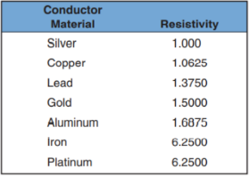
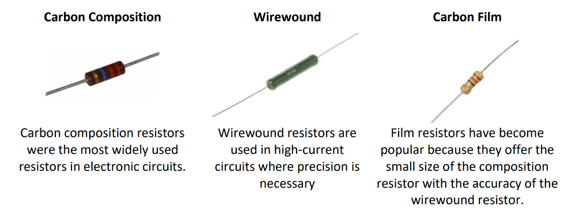
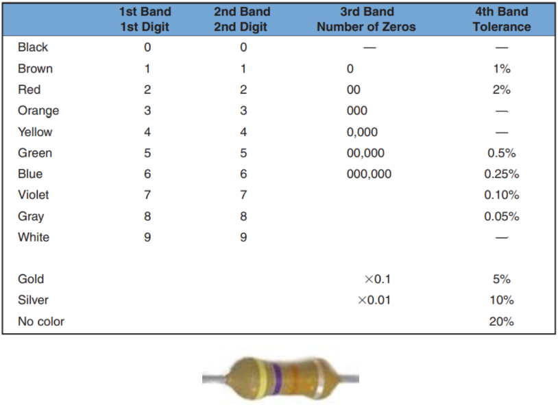

# Resistance

## What is Resistance?

### Definition of Resistance

Resistance is a property of materials that quantifies the opposition to the flow of electric current. It is a measure of how much a material resists the movement of electrons, the negatively charged particles that constitute an electric current.

**Conductors**: Materials like silver, copper, and aluminum are known as conductors and offer minimal resistance to current flow, facilitating easy movement of electrons.

**Insulators**: Conversely, materials such as glass, wood, and paper are called insulators and provide high resistance, hindering the flow of electrons.

### Factors Affecting Resistance

- **Material**: The intrinsic property of the material itself determines its resistance.
- **Wire Size**: In electric circuits, the cross-sectional diameter of the wire is crucial; wires with larger diameters have lower resistance, allowing for a smoother current flow.
- **Temperature**: The resistance of most conductive materials (like copper and aluminum) increases with temperature.

### Measurement and Units

- The resistance of a component or circuit is denoted by the symbol `R`.
- The unit of resistance is the **ohm** (`Ω`), named after the physicist Georg Simon Ohm.
- One ohm is defined as the resistance that allows one ampere of current to flow when a voltage of one volt is applied.

## Resistors

- **Function**: Resistors are specially manufactured components designed to provide a precise amount of resistance to electric current.

- **Usage**: Resistance is a property of all electrical components. Sometimes the effect of resistance is 
undesirable; other times it is constructive.  They are arguably the most ubiquitous components in electronic circuits, fundamental for controlling current flow and voltage distribution.

A resistor's tolerance is the range within which the resistor can vary from its stated resistance value and still be considered acceptable. It is more cost-effective for manufacturers to produce resistors with a larger tolerance when an exact value is not essential. Therefore, the larger the tolerance, the less expensive the resistor is to manufacture. 

Resistors are available with tolerances of ±20%, ±10%, ±5%, ±2%, and ±1%. Precision resistors with even tighter tolerances are also available. In most electronic circuits, resistors with a 10% tolerance are satisfactory.

Resistors fall into three major categories, named for the material they are made of: **molded carbon composition resistors**, **wirewound resistors**, and **carbon film resistors**

### Molded Carbon Composition Resistors

- **Construction**: These resistors are made from a mixture of carbon granules and a binder, which is then molded into a cylindrical shape.
- **Characteristics:**
  - **Non-inductive**: They have no winding, which makes them non-inductive and suitable for high-frequency applications.
  - **Tolerance**: They typically have wide tolerance ranges, often around ±5% or more.
  - **Stability**: Over time and under stress, they may change value due to the physical movement of the carbon granules.
  - **Surge Performance**: They handle surges better than other types due to the composition material's ability to absorb sudden energy spikes.

### Wirewound Resistors

- **Construction**: These are made by winding a metal wire, usually nichrome (nickel-chromium), around an insulating ceramic core.
- **Characteristics**:
  - **Precision**: They can be manufactured to high precision with tolerances as tight as ±0.01%.
  - **Temperature Coefficient**: They have a low temperature coefficient, meaning their resistance changes very little with temperature, which is good for stability.
  - **Power Rating**: They are capable of handling higher power loads compared to other types of resistors.
  - **Inductance**: Due to their coiled construction, they can exhibit inductive properties, which may not be suitable for high-frequency applications.

### Carbon Film Resistors

- **Construction**: These resistors are created by depositing a thin film of carbon on a ceramic form. The carbon film acts as the resistive material.
- **Characteristics**:
  - **Tolerance**: They can have tighter tolerances than molded carbon composition resistors, typically around ±2% to ±5%.
  - **Noise**: They tend to generate less electrical noise than carbon composition resistors, which makes them preferable in audio and signal processing circuits.
  - **Temperature Stability**: They offer better temperature stability than carbon composition resistors but not as good as wirewound resistors.
  - **Versatility**: Carbon film resistors are widely used due to their good performance across a range of conditions and their relatively low cost.

## Resistor Identification 

The small size of the resistor prevents printing the re- sistance value and tolerance on its case. 
Therefore, a color-coded strip system is used to display the resistor value. The strips can be seen and read in any position that the resistor is placed. The meaning of the colored bands on a resistor is as follows: 

- **The first band**, closest to the end of the resistor, represents the first digit of the resistor value.
- **The second band** represents the second digit of the resistor value.
- **The third band** represents the number of zeros to be added to the first two digits.
- **The fourth band** represents the tolerance of the resistor.

The resistor pictured here of this section has four bands coloured Yellow-Violet-Orange-Silver
- This means the resistor is a 47K Ohm with 10% tolerance. 
  - We know this because the first two bands (Yellow and Violet) have values of 4 and 7. 
- We then use the third band (Orange) as the multiplier which is 1K. 
- This gives us a resistance value of 47 multiplied by 1K or 47K. 
- The fourth band (Silver) indicates a tolerance of 10%