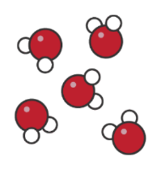
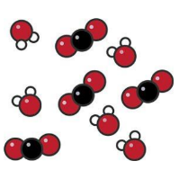
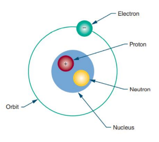

# Electricity To Its Atom

Everything, whether natural or artificial, can be broken down into either an element or a compound. 
However, the smallest part of each of these is the atom.

The atom is made up of protons, neutrons, and electrons. The protons and neutrons group together 
to form the center of the atom, called the nucleus. The electrons orbit the nucleus in shells located 
at various distances from the nucleus.

When appropriate external force is applied to electrons in the outermost shell, they are knocked 
loose and become free electrons. The movement of free electrons is called current. The external 
force needed to create this current is called voltage. As it travels along its path, the current 
encounters some opposition, called resistance.

## Matter, Elements and Compounds

### Matter

This is anything that occupies space and has weight. It may be found in any one of three states: solid, 
liquid, or gas. Examples of matter include the air we breathe, the water we drink, the clothing we 
wear, and ourselves. Matter may be either an element or a compound.

### Element

This is the basic building block of nature. It is a substance that cannot be reduced to a simpler 
substance by chemical means. There are now over 100 known elements. Examples of elements are 
gold, silver, copper, and oxygen.

### Atom

An atom is the smallest particle of an element that retains the characteristic of the element.

### Compound

The chemical combination of two or more elements. Examples of compounds are water, which 
consists of hydrogen and oxygen, and salt.

#### H2O

Water molecules are made up of two elements hydrogen (white atoms) and oxygen (red atoms).
Water has a specific ratio of two hydrogen atoms to one oxygen atom.

#### CO2

Carbon dioxide molecules are made up of two elements - carbon (black atoms) and oxygen (red atoms).
Carbon dioxide has a specific ratio is one carbon atom to two oxygen atoms.

### Molecule

The smallest part of the compound is called a molecule. A molecule is the chemical combination of 
two or more atoms.

## Mixture

The physical combination of elements and compounds is called a mixture. Examples of mixtures 
include air, which is made up of oxygen, nitrogen, carbon dioxide, and other gases, and salt water, 
which consists of salt and water.
This particle diagram shows a mixture made up of water and 
carbon dioxide.

- The water molecules each have two white hydrogen atoms and one red oxygen atom (H₂O).
- The carbon dioxide molecules each have one black carbon atom and two red oxygen atoms (CO₂).

## A Closer Look at Atoms

Every atom has a nucleus. The nucleus is located at the center of the atom. It contains positively charged particles called protons 
and uncharged particles called neu trons. Negatively charged particles called electrons orbit around the nucleus.

The electrons orbit in concentric circles about the nu cleus. Each orbit is called a **shell**. There are multiple shells around the 
nucleus which are in sequence to each other.

The outer shell is called the **valence shell**. The number of electrons it contains is the **valence**.

The farther the valence shell is from the nucleus, the less **attraction** the nucleus has on each valence 
electron. Thus the potential for the atom to gain or lose electrons increases if the valence shell is not 
full and is located far enough away from the nucleus.

**Conductivity** of an atom depends on its valence band. The greater the number of electrons in the 
valence shell, the less it conducts. For example, an atom having seven electrons in the valence shell 
is less conductive than an atom having three electrons in the valence shell.

Electrons in the valence shell can **gain energy**. If these electrons gain enough energy from an 
external force, they can leave the atom and become free electrons, moving randomly from atom to 
atom.

Materials that contain a large number of free electrons are called **conductors. Insulators**, the 
opposite of conductors, prevent the flow of electricity. Insulators are stabilized by absorbing valence 
electrons from other atoms to fill their valence shells, thus eliminating free electrons.

Halfway between conductors and insulators are **semiconductors**. Semiconductors are neither good 
conductors nor good insulators but are important because they can be altered to function as 
conductors or insulators.

An atom that has the same number of electrons and protons is identified as an **electrically balanced 
atom**. A balanced atom that receives one or more electrons is no longer balanced. It is said to be 
negatively charged and is called a negative ion. A balanced atom that loses one or more electrons is 
said to be positively charged and is called a positive ion. The process of gaining or losing electrons is 
called **ionization**.

## Current, Voltage, Resistance

### Current 

As the word current suggests, the meaning of current in electronics is close to that of the current in a 
river. You could think of the strength of the current in a pipe as being the amount of water passing a 
point in the pipe every second. This might be meas‐ ured in so many gallons per second. 

In electronics, current is the amount of charge carried by electrons passing a point in a wire per second
The unit of current is the ampere, abbreviated as amp or as unit symbol (`A`).

For many circuits, one whole amp is quite a large current, so you will see the units of mA (milliamp, a 
thousandth of an amp) a lot. 

### Voltage 

When there is an excess of electrons (negative charge) at one end of a conductor and a deficiency of 
electrons (positive charge) at the opposite end, a current flows between the two ends as long as this 
condition persists. The source that creates this excess of electrons at one end and the deficiency at 
the other end represents the **potential**, or the ability of the source to perform electrical work.

The actual work accomplished in a circuit is a result of the difference of potential available at the 
two ends of a conductor. This difference of potential causes electrons to move or flow in a circuit
and is referred to as **electromotive force (emf)** or voltage. Voltage is the force that moves the 
electrons in the circuit. Think of voltage as the pressure or pump that moves the electrons. 
The symbol e is used in electronics to represent voltage. The unit for measuring voltage is the **volt** (`V`).
It is the difference in voltage that makes a current flow in a wire. If there is no difference in voltage 
between one end of a wire and another then no current will flow.

### Resistance 

As the free electrons move through the circuit, they encounter atoms that do not readily give up 
electrons. This opposition to the flow of electrons (the current) is called resistance.

Every material offers some resistance or opposition to current flow. The degree of resistance of a 
material depends on its size, shape, and temperature. Materials with a low resistance are called 
conductors. Conductors have many free electrons and offer little resistance to current flow. Silver, 
copper, gold, and aluminum are examples of good conductors.

Materials with a high resistance are called insulators. Insulators have few free electrons and offer a 
high resistance to current flow. Glass, rubber, and plastic are examples of good insulators.
Resistance is measured in **ohms**. The symbol for the ohm is the Greek letter omega (`Ω`).

