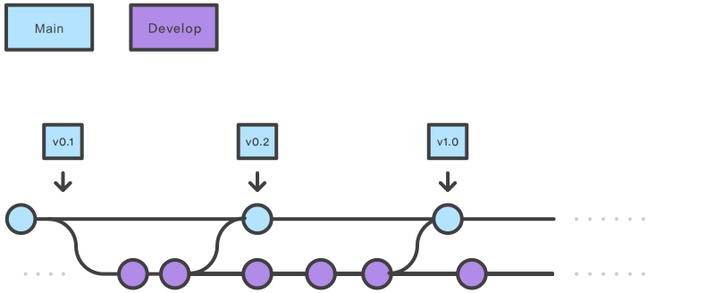
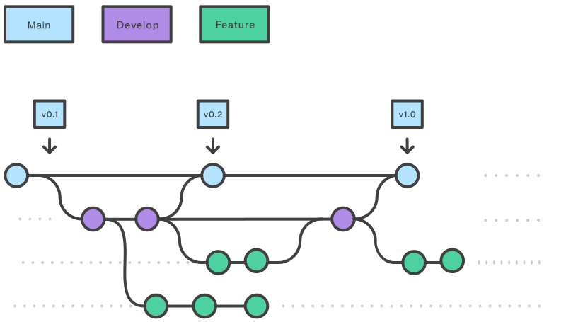
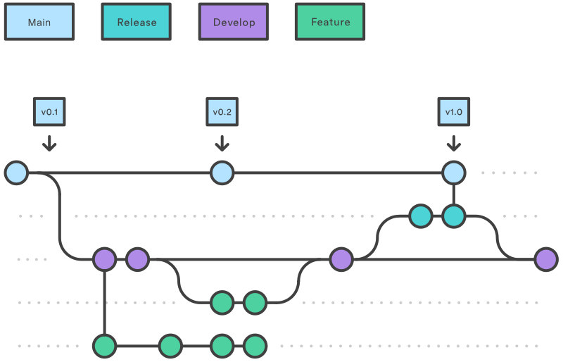
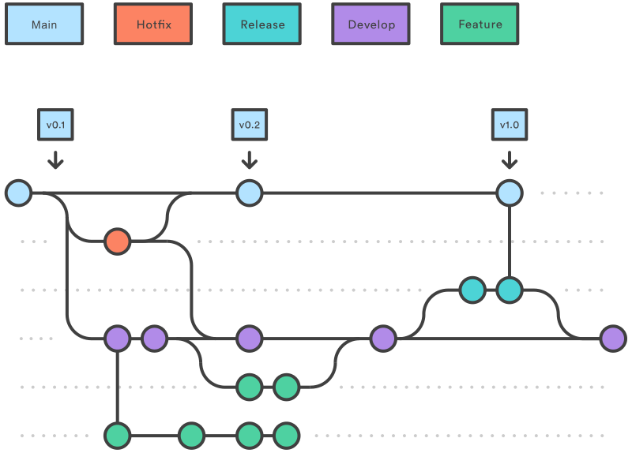

# Git Collaboration

## Where To Clone Repositories

When working with Git repositories as part of a team, it is considered a best practice to clone them onto a dedicated data drive or partition. This approach helps keep your project files organized and separate from other data on your system, providing a clear structure that enhances collaboration and maintainability.

The recommended structure for the data drive/partition is as follows:       
- `D:/Git/<category>/<repo-name>`      

For example:    
- `D:/Git/CPlusPlus/MyCoolPersonalRepo`
- `D:/Git/UnrealEngine/MyCoolPersonalRepo`
- `D:/Git/Qt/MyCoolPersonalRepo`

## Branch Flow Strategy

### Choosing a Branch Flow Strategy

The branching strategy you select for your team affects your code safety, feature release frequency, and speed of delivery, making this choice crucial to your development process.

There are several branching strategies that teams commonly use, including Git flow, feature branches, and trunk-based development. Among these strategies, Git flow or variants thereof are the most popular approaches. Here’s a short overview of the most popular branching strategies.

### Develop and main branches



- The **main branch** stores the official release history
- The **develop branch** reflects a state with the latest delivered development changes for the next release and serves as an integration branch for features.
- When the source code in the develop branch reaches a stable point and is **ready to be released**, all of the changes should be **merged back into the main branch**.
- It's also convenient to **tag all commits in the main branch** with a version number

### Feature branches



- **Each new feature** should reside in its **own branch**
- Feature branches use **develop** as their **parent** **branch**
- Features should **never** interact directly **with** **main**
- When you’re **done with the development** work on the feature, the next step is to **merge** the feature_branch **into develop**

### Release (staging) branches



- Once develop has acquired enough features for a release (or a predetermined release date is approaching), you **create** a **release branch** off **from develop**
- Creating this branch starts the next release cycle, so **no new feature**s can be added after this point. Only **bug fixes**, **documentation**, and **other release-oriented tasks** should go in this branch.
- Once it's **ready to ship**, the release branch gets **merged into main** and **tagged** with a **version number**

> [!NOTE] 
> Using a dedicated branch to prepare releases makes it possible for one team to polish the current release while another team continues working on features for the next release. It also creates well-defined phases of development (e.g., it's easy to say, “This week we're preparing for version 4.0,” and to actually see it in the structure of the repository).

### Hotfix branches



- **Maintenance** or “hotfix” branches are used to quickly patch **production releases**
- This is the **only branch** that should **fork directly off of main**
- As soon as the **fix** is **complete**, it should be **merged** into both **main** and **develop**
- **Main** should be **tagged** with an updated **version number**
  
## Branch Conventions

### Naming Conventions

Choose a descriptive and meaningful name for each branch. It should indicate the purpose or the feature being developed. Common branch naming conventions include:

- `feature/<category>/<feature-name>`
- `fix/<category>/fix/<bugfix-name>`
- `chore/<category>/<chore-name>`
- `docs/<category>/<documentation-topic>`

This can for example be `feature/logging/optimized-sorting`

It is also possible to remove the category if that fits better with your team.

- `feature/<feature-name>`
- `fix/<bugfix-name>`
- `chore/<chore-name>`
- `docs/<documentation-topic>`

This can for example be `feature/logging-optimized-sorting`

### Best Practices

- **Short-lived branches**: Keep branches short-lived to minimize the effort required to maintain and merge them. The longer a branch is active, the more likely it is to encounter merge conflicts and diverge from the main codebase.
- **Use Pull requests**: Use pull requests for merging code from feature, release, or hotfix branches into the target branch. This enables code review, discussion, and automated testing before the changes are incorporated into the main codebase.
- **Delete merged branches**: After a branch has been successfully merged and is no longer needed, delete it to keep the repository clean and organized.
- **Regularly sync remote in feature branch**: Regularly fetch and merge changes from the remote repository to your local branches to stay up-to-date and minimize merge conflicts.

## Commit Conventions

Conventional Commits is a specification for adding human and machine-readable meaning to commit messages. It follows a structured format that makes it easier to understand the changes introduced in a commit and automate tasks like versioning or generating change logs.

Using Conventional Commits provides several benefits, such as:

- **Improved readability**: The structured format makes it easier for team members to understand the changes in a commit at a glance.
- **Automation**: Tools like semantic-release can automatically determine the next semantic version number and generate change logs based on commit messages.
- **Collaboration**: A standardized commit format can facilitate communication and collaboration between team members and across projects.

The standard format for a Conventional Commit message is:

```
<type>(<scope>): <description>
```
- **Type**: Represents the category of changes made in the commit. Common types include:
    - feat (new feature)
    - fix (bug fix)
    - docs (documentation changes)
    - style (code style changes)
    - refactor (refactoring code)
    - test (adding or updating tests)
    - chore (maintenance tasks)
    - perf (performance improvements)
- **Scope** (optional): Describes the section or part of the codebase affected by the commit. For example, if a change is made to the authentication module, the scope can be specified as auth.
- **Description**: A brief summary of the changes made in the commit, written in an imperative mood (e.g., "Add new API endpoint" or "Fix broken login").

#### Example

Example with a feature:

```
feat(auth): Add two-factor authentication
```

Example with a bug fix:

```
fix(mqtt): correct typo in error message
```

> [!NOTE]
> More about the specification [here](https://www.conventionalcommits.org/en/v1.0.0/)

## Pull Request Conventions

Pull requests (PRs) are an essential part of collaborative development workflows. They enable developers to propose changes, discuss them, and review the code before merging it into the target branch. Following some conventions when creating and managing pull requests can help ensure a smooth and efficient process:

- **Deducated Branch**: Create a dedicated branch for the changes you want to propose. This branch should be based on the latest version of the target branch.
- **Small and focused**: Keep pull requests small, focused, and limited to a single feature, bugfix, or improvement. Smaller PRs are easier to review and understand, reducing the time and effort required for merging.
- **Descriptive title**: Write a clear and concise title for the pull request that summarizes the changes being proposed. This helps reviewers understand the purpose of the PR quickly.
- **Detailed description**: Provide a detailed description of the changes in the pull request. Explain the problem being solved, the solution implemented, any assumptions made, and any potential side effects or limitations. If applicable, include screenshots or other visual aids to help reviewers understand the changes.
- **Link to related issues**: If the pull request is related to an existing issue or task, link to it in the description. This helps establish context and ensures that the related issue is closed once the pull request is merged.
- **Label and assign**: Use labels to categorize the pull request and assign it to the appropriate team members for review. This helps organize and prioritize PRs within the project.
- **Request reviews**: Request reviews from relevant team members who are familiar with the affected code or have expertise in the area. This ensures that the changes are thoroughly reviewed and any potential issues are identified and addressed.
- **Respond to feedback**: Be responsive to feedback and comments from reviewers. Address any concerns or suggestions and update the pull request as needed. Engage in constructive discussions to reach a consensus on the best solution.
- **Resolve conflicts**: If there are any merge conflicts with the target branch, resolve them promptly to ensure that the pull request can be merged smoothly.

The following shows an example on how you could **organize your description**:

```
# Feature

- **package-1**
  - added this and that because of reason a
  - added this and that because of reason b and c
- **package-2**
  - added this and that because of reason d and e
    - More info here
    - Some more info 
   
# Fixes

- **package-3**
  - fixed this and that because of reason a
  - fixed this and that because of reason b
```

> [!NOTE]
> When using **Visual Studio Code**, make sure to checkout the following **extention**: see link [here](https://marketplace.visualstudio.com/items?itemName=GitHub.vscode-pull-request-github)
This makes it very easy to review pull requests!

## Versioning Conventions

### Why Use Versioning

- **Semantic Versioning (SemVer)**: As you've already mentioned, SemVer is a widely adopted system for versioning software. It provides a clear and meaningful version numbering scheme that conveys the nature of changes between releases. It's important to understand and correctly apply SemVer rules.

- **Version Control Systems**: Versioning is tightly integrated with version control systems like Git. Tags in Git are often used to mark release points in the history of your project.

- **Dependency Management**: In a project with dependencies, it's crucial to understand how versioning affects them. Using too strict version constraints can lead to dependency hell, while being too loose can lead to incompatibility and breaking changes.

- **Continuous Integration/Continuous Deployment (CI/CD)**: Your versioning strategy should integrate seamlessly with CI/CD pipelines. This can include automating version increments and tagging as part of the deployment process.

- **Changelog Management**: Maintain a changelog that documents all the changes made with each version. This is important not just for your users, but also for developers who may need to understand the history of changes.

- **Release Branching Strategy**: In larger projects, you may have different branches for different versions, especially when you need to maintain multiple major versions simultaneously. This requires a good branching strategy, like Git Flow or Trunk Based Development.

- **Pre-release and Build Metadata**: SemVer allows for pre-release versions and build metadata. Pre-release versions (like alpha, beta, rc) are for testing and feedback, and build metadata can include information like build dates, commit hashes, or other environment specifics.

- **Version Pinning**: In some cases, especially with critical systems, you might need to pin to a specific version to ensure that the system remains stable and changes do not break the existing functionality.

- **Deprecation Policy**: As part of your versioning strategy, have a clear deprecation policy. Communicate when certain features are to be deprecated and in which version they will be removed.

- **API Versioning**: If you're developing APIs, versioning becomes even more crucial. You need to ensure that clients have a clear path for upgrading and that you maintain backward compatibility as much as possible.

- **Package Managers**: Understand how different package managers handle versioning. This can affect how you version your own packages and how you specify your dependencies.

### Basic Versioning

- **Release**: A tuple of integers representing the parts of the release segment of the version (`major`, `minor`, and `micro`).
- **Major**: The major part of a version number (e.g., the "`3`" in "`3.10.2`").
  - Increment this when you make incompatible API changes.
- **Minor**: The minor part of a version number (e.g., the "`10`" in "`3.10.2`").
  - Increment this when you add functionality in a backward-compatible / non-breaking manner.
- **Patch/Micro**: The path part of a version number, often referred to as the patch number (e.g., the "`2`" in "`3.10.2`").
  - Increment this when you make backward-compatible / non-breaking bug fixes.

### More Advanced Versioning

- **Pre-release**: A tuple containing the pre-release phase and the pre-release number (e.g., ('`alpha | beta | rc`', `1`) for "`3.10.2-aplha.1`").
  - This indicates an upcoming release that may not be stable and is intended for testing.
- **Post-release**: An integer representing the post-release number (e.g., the "`1`" in "`3.10.2-1`").
  - Use this for updates after the initial release that don't change the version number.
- **Dev-release**: An integer representing the development release number (e.g., ('`dev`', `1`) in "`3.10.2.dev1`"
  - This indicates a development build that precedes the final release.
- **Local-version**: The local version segment of the version number, which follows the + sign (e.g., the "`exp.sha.5114f85`" in "`3.10.2+exp.sha.5114f85`").
  - This is often used for local or custom builds with specific build metadata.
- **Base-version**: The version number without any pre-release, post-release, or development release tags (e.g., "`3.10.2`" from "`3.10.2-alpha.1`").
  - This is the main version number that the qualifiers are based upon.

> [!NOTE]
> More about the specification [here](https://semver.org/)