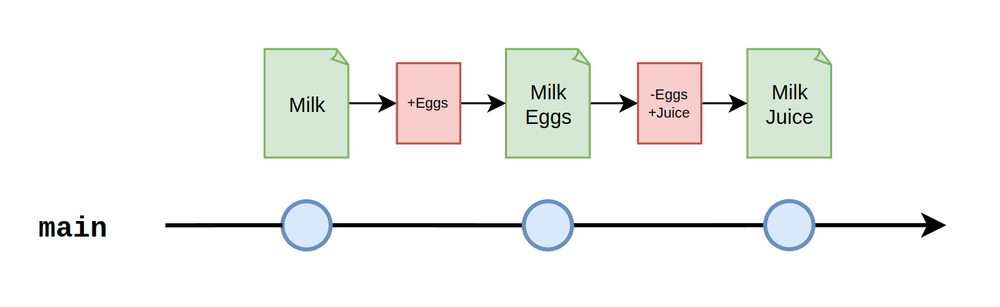

# Visual Examples

## Checkout, Edit, Commit

1. **Checkout**: This step refers to the process of switching between different branches or commits in a Git repository. When you checkout a branch, Git updates your working directory to reflect the latest commit of that branch, allowing you to work on that specific snapshot of the project. You can checkout branches by using the command `git checkout <branch-name>`.

2. **Edit**: After checking out a branch, you can start making changes to the files in your working directory. Editing can involve adding, modifying, or deleting lines of code or even entire files. This step is where you actually work on the project, implementing features or fixing bugs.

3. **Commit**: Once you have made your changes and tested them, you need to save those changes to the repository. Committing is the process of creating a new snapshot of the project's history that includes your latest changes. To commit, you first stage the changes by using the command `git add <file>` or `git add .` (to stage all changes). Then, you create a commit with a descriptive message using `git commit -m "Your commit message here"`.


## Diffs

In Git, a "diff" is short for "difference" and is a representation of changes made between two sets of code or commits. Diffs are helpful for comparing changes in files across different versions, identifying what was added or removed, and understanding the evolution of a project. They are also useful during code reviews and for tracking down issues in the codebase.

1. Let's assume you have a file called shopping_list.txt that initially contains "Milk"
2. The diff for Commit 1 would show that the line with "Eggs" was added
3. The diff for Commit 2 removed "Eggs" and added "Juice"

To view diffs in Git, you can use the git diff command, followed by the commit identifiers you want to compare. For example, if you want to see the changes between the original file and Commit 1, you would use `git diff <original-commit> <commit-1>`. Similarly, to see the changes between Commit 1 and Commit 2, you would use `git diff <commit-1> <commit-2>`.



## Feature Branch

Feature branches are a best practice in collaborative software development, allowing developers to work on independent features or bug fixes without interfering with the stable "main" branch.


In the image, there are two workstreams:

- "**Your work**": This represents the feature branch that you're currently working on. It is a separate branch created from the main branch. You can make changes, commit, and even push your work to the remote repository without impacting the main branch. Your work-in-progress (WIP) remains isolated until it's complete, tested, and ready to be merged with the main branch.
To create a feature branch, you would typically use the following commands:

```shell
git checkout main
git pull
git checkout -b your-feature-branch
```

- "**Someone else's work**": This represents the work of another developer, who has completed their feature branch and merged it into the main branch. The main branch now contains their changes, and all other developers can update their local main branches and base their new feature branches on the latest version.
To merge a feature branch into the main branch, one would typically follow these steps:

```shell
git checkout main
git pull
git merge your-feature-branch
git push
```

The image shows the relationship between your feature branch, someone else's work, and the main branch. It emphasizes the importance of isolating development efforts in feature branches, ensuring stability in the main branch, and merging completed work when it's ready.

This branching model helps to avoid conflicts, enables parallel development, and promotes better code quality through easier code reviews and testing.

## Conflicts

Git conflicts arise when two or more developers have made changes to the same lines of code in the same file, and Git cannot determine which change should be accepted.


- "**Someone else's work**": This represents the work of another developer who has already merged their feature branch into the main branch. The main branch now contains their changes.

- "**Your work**": This represents the feature branch that you're currently working on, which is based on an older version of the main branch. You want to merge your work with the main branch, but there's a conflict between your changes and the changes in the main branch.

When you try to merge your feature branch into the main branch, Git will attempt to combine the changes automatically. However, if there are conflicts, Git will raise a conflict error and mark the affected files with conflict markers, indicating the conflicting changes.

Using VS Code, it is possible to resolve the conflicts in the 3-way merge editor. The 3-way merge editor displays separate views for Incoming changes (on the left), Current changes (on the right), and the Result of the merge (at the bottom). Conflicts are highlighted and can be resolved by using the CodeLens buttons.


## Tagging

Git tagging is a way to mark specific points in a repository's history as important, usually to indicate a release or milestone. Tags are like references to a specific commit and can be assigned a meaningful, human-readable name.


- **Main starting from v1.2.1**: This represents the main branch in the repository, marked with a tag "v1.2.1", indicating a specific version or release of the project. The tag points to a particular commit, capturing the state of the project at that point in time.

- "**Someone else's work**": This represents the work of another developer who has completed their feature branch and merged it into the main branch. After merging, a new tag "v1.2.2" is created to indicate the updated version of the project. This new tag points to the merge commit where the feature branch was combined with the main branch.

- "**Your work**": This represents the feature branch that you're currently working on. Once you've completed your work, you would merge your branch into the main branch and create a new tag (e.g., "v1.2.3") to indicate the next version or release of the project.


To create a tag in Git, you can use the following command:

```shell
git tag -a <tag-name> -m "Tag message"
```

For example, to create a tag for your merged work, you would use:

```shell
git tag -a v1.2.3 -m "Release version 1.2.3"
```

After creating the tag, you should push it to the remote repository using the command:

```shell
git push origin <tag-name>
```

The relationship between Git tags, the main branch, and feature branches, emphasizing the importance of using tags to mark specific versions or milestones in a project's development. This practice enables easier tracking of project releases and simplifies navigation through the project's history.

## Merging vs Rebasing

Merging and rebasing are two methods to integrate changes from one branch into another.


#### Merging

Merging is the process of taking two branches and combining them into a single branch, while preserving the history of both branches. When you merge two branches, a new merge commit is created, which has two parent commits, one from each branch. This new commit represents the combined state of the branches.

Pros of merging:

- The history of both branches is preserved, making it easy to understand the project's development timeline.
- Merges are non-destructive, meaning that the original branches remain intact.

Cons of merging:

- Merge commits can clutter the history and make it harder to read.
- If there are many merges, it can be difficult to trace the changes introduced by a specific branch.


#### Rebasing

Rebasing is the process of moving or "replaying" a series of commits from one branch onto another. Instead of creating a new merge commit, rebasing rewrites the commit history of the feature branch so that it appears as if it was built directly on top of the base branch.

"**On rebasing**" usually refers to the process of rebasing in progress. Git will apply each commit from the feature branch to the base branch, one at a time. Conflicts may arise during this process, and they must be resolved before continuing the rebase.

"**Rebased**" refers to the state of the branch after the rebasing process is completed. The feature branch now has a linear history, as if it was developed directly on top of the base branch.

Pros of rebasing:

- The commit history remains clean and linear, making it easier to read and understand.
- It avoids unnecessary merge commits.

Cons of rebasing:

- Rebasing rewrites the commit history, which can be confusing and problematic for collaborators if not done correctly.
- It can be more difficult to resolve conflicts, as they must be addressed one commit at a time during the rebasing process.