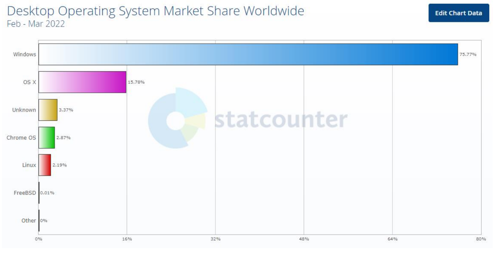

# Welcome To Linux!

## What is Linux?

Welcome to the world of Linux! Originating from the UNIX operating system, Linux stands out as open-source software. This means you have the freedom to view, modify, and distribute its source code according to your needs.

### Linux: The Kernel and the Operating System

The name "Linux" technically refers to an operating system "kernel", a single but key component of a complete operating system. In everyday use, the term "Linux" is frequently used to refer to a complete operating system which consists of the kernel and some of the thousands of other programs required to make an operating system useful. Much of the important system software that 
is typically installed on a Linux system comes from The GNU Project, a project to build an operating system made entirely of free software.

### The Genesis and Evolution of Linux

The first Linux kernel was created by Linus Torvalds. It was first released on 5 Oct 1991. It was 
started as an x86-only, single-processor operating system, but grew to become one of the most 
ported pieces of software.

### Linux in the OS Landscape

Linux shares the stage with other operating systems like macOS, iOS, or Windows. A notable aspect of Linux is its role in the creation of Android, one of the most powerful and prevalent platforms today.

### Defining an Operating System and the Kernel

**Operating System (OS)**: An OS is a complex suite of software that manages the overall operations of a computer. Its primary functions include managing hardware resources (like CPU, memory, and disk space), executing and scheduling tasks for various applications, and providing a user interface, which may be graphical (GUI) or command-line-based (CLI). The OS abstracts the complexity of hardware interactions, offering a user-friendly environment for running applications.

**Kernel**: At the heart of the OS is the kernel, a crucial component responsible for low-level operations. It acts as the intermediary between hardware and software, managing system resources at the most fundamental level. Key functions of the kernel include:

- **Memory Management**: The kernel handles memory allocation for processes and manages virtual memory, ensuring efficient use of physical memory and storage.

- **Process Management**: It is responsible for process scheduling, creation, and termination. The kernel allocates CPU time to processes and manages process states and priorities.

- **Device Management**: The kernel controls hardware devices through drivers, managing input/output operations and ensuring smooth hardware-software interactions.

- **System Calls and Security**: The kernel processes system calls, which are requests by applications for resource access or services. It also enforces security policies and access control, maintaining system integrity and user data privacy.

### Differences Between OS and Kernel:

- **Scope and Composition**: The OS is a comprehensive system that includes the kernel, system utilities, libraries, and user interfaces. The kernel, however, is focused solely on the core functionalities of hardware management and low-level system operations.

- **Interaction Level with Hardware:** The kernel directly interacts with the computer's hardware, managing essential tasks at a low level. The OS, encompassing the kernel, operates at a higher level, integrating these low-level operations into a cohesive system accessible to the user.

- **Abstraction Level**: The kernel functions at a lower level of abstraction, dealing directly with the hardware's nitty-gritty. In contrast, the OS provides a higher level of abstraction, offering an environment where users and applications can perform tasks without needing to understand or manage the underlying hardware complexities.

In essence, the kernel is the fundamental core of the OS, dedicated to managing the hardware and basic system operations. The operating system, in turn, extends beyond the kernel, providing an integrated and user-friendly platform for application execution and user interaction.

### Linux's Versatility and Applications

Linux's capability to perform diverse tasks is unparalleled. Each piece of software within this operating system plays a specific role, making Linux a popular choice for web servers, scientific computation, network operations, database management, desktop computing, and powering Android-based mobile devices.

### Linus Torvalds 

The story started in 1991 with the message of Linus Torvalds, a 21 years old computer scientist. He wanted to create a new free 
operating system kernel. Torvalds chose penguin as the mascot of Linux in 1996. It was developed as part of the GNU project licensed under the GNU General Public License, a free software license. The project gained the support of a large number of volunteers and in time Linux has reached its current position.

By that time he studied computer science at the University of Helsinki. With the aim of creating a new free operating system, he 
announced Linux kernel and began to write the operating system for his current hardware. He announced this project and requested 
help from the developers. So it started as a hobby project. Linux is a registered trademark of Linus Torvalds

Linus Torvalds in 2012:     

### Where Linux Thrives Today

In 1991, Linux was just a little baby. But this baby grew massively, and it became so popular. Today, 
Linux powers over 90% of the world's top supercomputers. And to add to your surprise, you may 
have been using Linux for years without noticing. How? Well, if you ever used an Android 
smartphone, then you have used Linux, and that's because Android is a Linux distribution!

On a more serious matter, the majority of government servers run Linux, and that's why you will see 
a lot of government technical jobs requiring Linux-skilled individuals. Also, big companies like 
Amazon, eBay, PayPal, Walmart, and many others rely on Linux to run their advanced and 
sophisticated applications. Furthermore, Linux dominates the cloud as more than 75% of cloud 
solutions run Linux.

Linux also runs on many embedded devices and is the backbone of the popular Raspberry Pi, Beagle 
Bone, and many other microcontrollers. You may even be surprised to know that some washing 
machines run on Linux! So every time you go and wash your clothes, take a moment, and be 
thankful for having Linux in our lives

### Linux Across Various Domains

Linux excels in multiple domains:

- **Server OS**: Ideal for high-volume, multithreaded applications, Linux is extensively used in file, web, email, and database servers.

- **Desktop OS**: On personal computers, Linux offers a free, open-source desktop environment, blending productivity with user-friendliness.

- **Embedded Devices**: Its customizability and performance make Linux perfect for embedded systems in automotive systems, network appliances, and even household devices.

- **Network OS**: Linux powers a range of networking hardware, from routers to domain name system servers, exemplified by Cisco's Internetwork Operating System using the Linux kernel.

- **Cloud OS**: Many cloud computing providers rely on Linux for their infrastructure, leveraging its stability and scalability.

- **Software Development OS**: Linux is a haven for developers, offering a transparent, open system with a suite of tools like bash shell, open-source editors, Git, Ansible, and free compilers for various programming languages.

## The Linux Kernel and Core Operating System Features

### The Linux Kernel

The Linux Kernel is the foundational layer of the OS, acting as the intermediary between software and hardware.         
It has four critical responsibilities:

- **Device Management**: It manages various hardware devices like CPUs, sound and graphics cards, storing information about each and facilitating their communication.

- **Process Management**: The kernel prioritizes processes for the CPU, manages execution time, and handles security and ownership data.

- **Memory Management**: Responsible for allocating and managing RAM and swap space efficiently.

- **System Calls Management**: Manages system calls, the requests made by applications to access hardware resources.

### Core Operating System (OS) Features

- **Detecting and Preparing Hardware**: Upon boot-up (`BootLoader`), the system identifies hardware components and loads necessary drivers.

- **Managing Processes**: The OS keeps track of multiple processes, managing their access to the CPU and facilitating their start, stop, and status changes. A process in Linux is called a `Daemon`.

- **Managing Memory**: Allocation of RAM and swap space to applications.

- **Providing User Interfaces**: From the original command-line shell to modern graphical desktop interfaces

- **Controlling Filesystems**: Manages filesystems, including file and directory ownership and access.

- **User Access and Authentication**: Enables the creation of distinct user and group accounts for file and process management.

- **Starting up Services**: Daemon processes provide various system and network services, like web, mail, database, printer, file, DNS, and DHCP servers.

### Interesting Linux Features

- **Security**: Linux is known for its robust security model, which includes SELinux for enforcing security policies and compartmentalizing applications to prevent system-wide breaches. Its security is integral to its architecture, making it a choice for sensitive applications.

- **Performance and Resource Management**: Linux often shows superior performance in server environments, especially under high load conditions.

- **Package Management**: Linux provides advanced package management like APT that are more integrated and versatile than Windows, making software installation and management more efficient. hey simplify the process of managing software dependencies and versioning.

- **User & File Management**: Linux offers versatile user and file management, with powerful command-line tools and permissions models. It allows for granular control over system access and file operations.

- **Containerization and Orchestration**: Linux's support for Docker and Kubernetes makes it a key player in the field of containerization and orchestration, providing efficient resource utilization and application deployment.

- **Real-Time Computing**: Linux can be configured for real-time computing to ensure that high-priority processes receive immediate processing time, crucial for time-sensitive tasks.

### Drivers

Drivers are typically considered part of the operating system (OS) rather than the kernel itself due to their role and how they are managed within the system. Here's a more detailed explanation:

- **Drivers**: Drivers are software components that enable the OS to communicate with hardware devices. Each driver is specific to a hardware component (like a printer, video card, or network adapter) and serves as a translator between the hardware's specialized language and the more general language of the operating system.

- **Kernel**: The kernel is the OS's core, managing crucial tasks like resource allocation and low-level hardware interaction. It provides a fundamental layer that enables the OS and its applications to interact with the hardware.

- **Integration of Drivers with the Kernel**: Drivers often operate within the kernel space, meaning they work closely with and sometimes as part of the kernel. This integration allows them to perform hardware communication efficiently. However, they retain a certain level of independence, as they can be loaded and unloaded as modules, and updated without altering the kernel.

- **Address Space:** Kernel modules, including drivers, operate in a separate kernel space, distinct from the user space where applications run. This separation protects system software from user programs.

- **Updates and Management**: Drivers are typically developed and updated separately from the kernel. This separation allows for flexibility - hardware manufacturers can release new drivers without needing to modify the kernel.

## Advantages of Linux 

Linux is a highly secure operating system. Your security and privacy are put first before anything else in Linux. There are locks on every layer which prevent your system from getting hijacked. The cases of a daily Linux user getting Virus are sporadic. Linux does not generally get a virus because it is lock out malware and other software, causing trouble. Also, since it does not have a significant share in the market, Hackers and viruses usually do not target Linux distributions meant for daily use.

There is also a very great diversity among different Linux distributions making it harder for malware to target you and disrupt your peaceful life. Unlike Windows, where every user is an Administrator, Linux highly restricts root access. The typical user only has enough permission to use the system without causing trouble.

Because Linux users have low automatic access rights and require additional permissions to open attachments, access files, or adjust kernel options. It is harder to spread malware and rootkits on a Linux system.

### Stable

Although Linux systems get bugs that are hard to troubleshoot and solve, they are rare. Linux distributions are pretty stable and constantly updates with the latest bug fixes. Every Linux distribution is tested thousands of times before releasing a stable version. When the Linux kernel gets an update, it is tested by your Linux distribution developers beforehand to ensure that it is 
stable and compatible with the operating system. These layers of stability checks keep your system bug-free and ensure the best performance.

### Free and Open Source

Linux is released under the GNU GPL license. It is free to download, use and share in any way you want. This means you can contribute to the Linux system and review the code and any functionality yourself. You need not pay a single penny for using Linux ever. You can use Linux for free as long as you want. Linux software are also mostly open-source and free. You get a variety of thousands of free software which you can choose from and easily install from the Software manager.

Unlike Windows and Mac ecosystem, Linux does not cost you and keeps you in the free software loop. You can use alternatives to any popular software free on Linux, and some are good options while others are even better than the original software.

### Absolute Freedom Over Your System

Linux distributions give you absolute freedom over your system. You are free to do whatever you want, customize however you want, tweak as much as you wish; there are no restrictions. You can even change your whole desktop environment or make your system look just like Windows or Mac.There are tens of desktop environments available that you can choose from. A few of them are Cinnamon, Mate, Unity, KDE, and hundreds of themes and docks. You are free to change your system to maximum possibility and install anything without restriction

### High performance

Linux systems are very low on resources and can run on even 500 MB ram or at 256 MB RAM at the lowest. Linux uses resources very efficiently and can run on low spec hardware quickly. While Windows and Mac struggle to perform well on even good hardware, Linux is used to revive old computers with meager specs. Suppose you are also facing the issue of Windows running slower on
your system. In that case, you should consider giving Linux a try.

### Proper use of system resources

Linux uses system resources very efficiently. Be it RAM or HDD. You need not have much space on your system to run Linux. Even 10 GB is enough to run any Linux distribution properly. Linux can manage itself even when there is almost no space left on the system. This is probably the best advantage of Linux.You need not worry about space management on your storage device. Linux uses 
very little space and can function smoothly on that. On the other hand, Linux distributions are very lightweight. They function smoothly on even the oldest hardware and the lowest RAM. You can choose a Linux distribution and desktop environment that best support your hardware from a wide range and variety.

### Better software updates

Linux beat every operating system in terms of Software and system updates. New and more stable updates are released once in a while, and these software are very easy to upgrade to. Unlike Windows, which takes hours to upgrade/update, Linux updates are short in download size and take under a minute to install with no reboot required.

So that next time when you switch on, you won’t have to deal with an “updating the system” message for hours. Linux updates are also very stable and ideally tested before publication. The chances of updates breaking your system in Linux are very rare. A new version of the operating system is also released yearly, which you can upgrade to without removing your old operating
system and directly upgrading to.

### Compatibility with Programming and Development

Linux supports a wide range of programming languages and tools out of the box. It's a preferred OS for developers, especially with its inclusion of powerful tools like bash scripting and support for almost all the major programming languages and their development environments.

## Disadvantages of Linux 

### No standard edition

Instead of one single edition like Windows and Mac, Linux has several community-developed editions called Distro or distributions. This often confuses newbies. Choosing a standard Linux operating system for use is difficult for beginners. No standard edition also means that the community is divided. Getting support for one special edition of Linux will be even more challenging.

Every Linux operating system has its own separate package manager, for which each software must be packed differently. This makes publishing software for Linux a tedious task. Linux can also not compete with Windows and mac due to the same reason. However, if it has just one and only one single standard edition, then the story would be a lot different.

### Hard learning curve

For Windows users and users with less technical experience, learning Linux is hard. You need to know how to handle the Terminal. It is very similar to the command prompt in Windows. Although you won’t use Terminal every time you do something in Linux, but you will have to use it to complete your task at one point or another. There are tons of tutorials for learning Linux on the web.

However, the learning curve of every Linux distribution is different. For example, some Linux distros like Linux mint are made beginner-friendly, while distributions like Arch are pure pain for even experienced Linux users.

### Limited market share

Limited Market Share is the biggest problem Linux is facing currently. Due to its small market share, popular Windows and Mac applications are not ported to Linux by developers. This is the reason why many people don’t use Linux. Your favorite applications might and might not be available for Linux.

### Lack of proprietary software

Many big developers don’t even bother publishing their software on Linux because of its small market share. You will have to use third-party software like Wine or use Virtualbox to get your favorite software up ad running on Linux. One such example is Adobe. No Adobe software is available for Linux, and most don’t operate properly over Wine.

Linux also lacks good video editing software. There are only two helpful video editing software; Kendlive and DaVinci Resolve. While DaVinci Resolve is for more advanced video editing, Kdenlive is for simple video edits.

### Difficult to troubleshoot

Troubleshooting in Linux might be complex if you are not a tech expert. It is also hard to find someone to help you with your Linux problems. Every user faces different issues, and an answer to that might not be available on the web. Issues are caused due to different Hardware and software, and the user will have to find a cure for the problem himself. Most of the Linux software are open source and developed by various community users. You get no warranty, and the software might or might not work on your system. Finding technical support regarding such software is also very time consuming. You will have to submit a bug report and wait for the publisher to solve the issue.

### Poor support for games

Popular video games run on Window’s Direct X technology which is not available for Linux. Hence, Linux misses out on many games. For the past few years, Steam has done great work to bring more games to the Linux platform. Technology like Steam Proton, Wine, and Lutris make gaming on Linux possible. However, they are still not native to Linux and do not run as smoothly as they would run on the platform they are made for. However, this is not a significant downside of Linux because, with fast-evolving technology like Cloud gaming, it is now possible to play any game on Linux.

### Unsupported hardware

This is one more significant issue with Linux distributions. There is no proper concept of Drivers in Linux like other operating systems. Instead, all drivers are built in the Linux kernel itself. But the Kernel cannot have drivers for every Hardware. This raises a compatibility issue with some hardware devices. Printers and WiFi cards are most hit with this issue. Users generally face problems while using printers with Linux. Many WiFi cards that come pre-installed in your Laptop might not be compatible with Linux or need extra configuration to work.

### Lack of technical support

Sooner or later, you will surely need technical support for your system. However, unlike Windows and Mac, there are no local stores or on-demand support services you can use to solve your problem. You will have to depend on the Linux community on Stackoverflow, Reddit, and various other community forums, which can not guarantee instant help or expertise. It is also hard to figure out the problem in Linux, so the chances are that if you are facing some driver or hardware-based issue, then you will have to hope to another Linux distribution.
