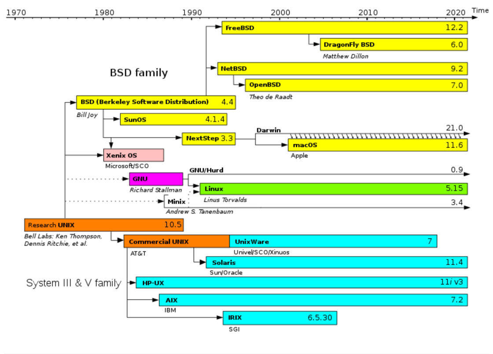
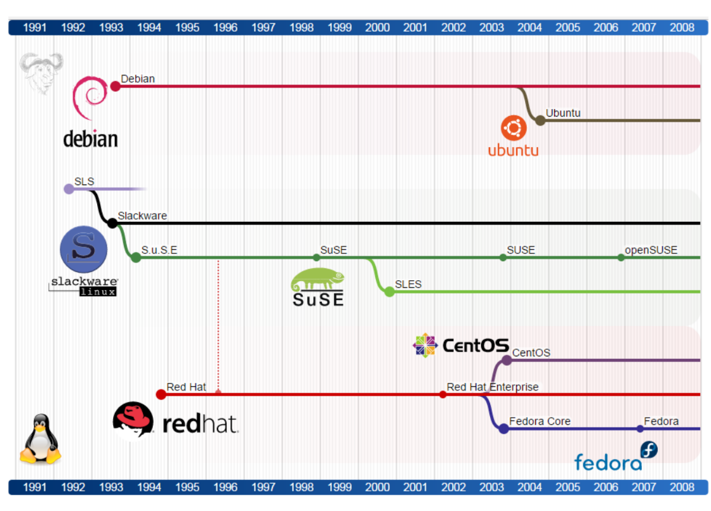

# Linux History

## The beginning of the UNIX project 

The inspiration for UNIX came from the Multics project at the Bell Laboratories. This project aimed at building a multi-user operating system with single-level storage, dynamic linking, and a hierarchical file system. The project was in collaboration with AT&T. Later, however, this project came to an end in 1969 due to financial issues.

Even after the discontinuation of the project, two scientists **Ken Thompson** and **Dennis Ritchiecontinued** working with the idea. This led to the invention and implementation of the Unix OS in 1969. The first version was released in 1970. 

2 years later they created C out of UNIX. And there comes the future base of many programming languages! C added portability and availability to UNIX and thus it became increasingly popular, widely adopted, modified, and copied by businesses and academic institutions across the globe. The reason for UNIX gaining popularity was its availability and portability. Unix in its early days was proprietary software.

## The beginning of the GNU Project 

In the year 1983, **Richard Stallman** was working along with the Free Software Foundation(FSF) to come up with the first free UNIX-like operating system. This was called the GNU project. He wrote GPL (GNU General Public License) as a part of his project. GNU was intended to become a recoding of the entire UNIX operating system that could be freely distributed.

Stallman also launched the Free Software Foundation (FSF) on the principle that "any user can study the source code, modify it, and share the program" for any participating software.

During this project, Richard came up with ‘Hurd‘ which is the GNU Kernel. However, Hurd, the GNU kernel couldn’t pull enough development work leaving GNU incomplete. GNU was later used by Linus Torvalds for developing Linux. GNU’s short for “GNU’s not Unix!“. It’s a recursive acronym, as there’s no real full-form of the word GNU.

Although rewriting millions of lines of code might seem daunting for one or two people, spreading the effort across dozens or even hundreds of programmers made the project possible. Remember that UNIX was designed to be built in separate pieces that could be piped together. Because they were reproducing commands and utilities with well-known, published interfaces, that effort could 
easily be split among many developers.

It turned out that not only could the same results be gained by all new code, but in some cases that code was better than the original UNIX versions. Because everyone could see the code being produced for the project, poorly written code could be orrected quickly or replaced over time.

Essentially, the GNU's development of a very important low-level component called the kernel (GNU Hurd) did not fully materialize. This is where Linux, a kernel developed by Linus Torvalds (among others), entered the picture. According to GNU: "Linux is the kernel: the program in the system that allocates the machine's resources to the other programs that you run. The kernel is an essential part of an operating system, but useless by itself; it can only function in the context of a complete 
operating system."

## MINIX 

In 1987, American-Dutch Professor **Andrew S. Tanenbaum** wrote UNIX-like system MINIX for academic use. The source code of MINIX was made available for everyone, however, MINIX couldn’t be either modified or redistributed. MINIX’s 16-bit architecture wasn’t well adapted to Intel’s increasingly popular 386 design for PCs. It became highly expensive for private users to use UNIX for 
Intel 386 personal computers.

And this led to Linus Torvalds’ beginning of a new project. Later Linus Torvalds stated that if either 386BSD or GNU Hurd was available during his time, he wouldn’t be interested in writing his project.

## Linux 

Linus Benedict Torvalds was born on 28 December 1969 in Helsinki, capital of Finland. He studied at the University of Helsinki in Finland. This is where he started working on a project for ‘fun’. This very project turned out to be the Linux kernel. It was based on MINIX. He created Linux as a part of his Master’s thesis titled, ‘Linux: A Portable Operating System’. He was just 21 years old when he started working on Linux.

Torvalds only developed the Linux Kernel. The Linux operating system is a collaboration between millions of developers all around the world, involving the GNU Project, the Linux kernel development team (headed by Torvalds), and others.

The kernel was seen as “the last missing piece” of the GNU operating system by the GNU project. In 1991, Linus Torvalds released the first version of the Linux kernel. There was now enough software for a completely free operating system.

GNU purists argue that references to Linux as the complete operating system that exists today should instead be written as GNU/Linux, in acknowledgment of the pair's symbiotic relationship. Others tend to focus on the fact that Linux (with no prefix) has become a more mainstream term. That is why the correct way to refer to any Linux operating system using GNU is GNU/Linux.

## BSD 

The one software project that had a chance of beating out Linux to be the premier open source kernel was the venerable BSD project. By the late 1980s, BSD developers at University of California (UC) Berkeley realized that they had already rewritten most of the UNIX source code they had received a decade earlier.

Just as UC Berkeley was preparing a complete, UNIX-like operating system that was free from all AT&T code, AT&T hit them with a lawsuit in 1992. The suit claimed that the software was written using trade secrets taken from AT&T’s UNIX system.

It’s important to note here that BSD developers had completely rewritten the copyrightprotected code from AT&T. Copyright was the primary means AT&T used to protect its rights to the UNIX code. Some believe that if AT&T had patented the concepts covered in that code, there might not be a Linux (or any UNIX clone) operating system today.

Today, BSD versions are available from three major projects: FreeBSD, NetBSD, and OpenBSD. People generally characterize FreeBSD as the easiest to use, NetBSD as available on the most computer hardware platforms, and OpenBSD as fanatically secure. Many security-minded individuals still prefer BSD to Linux. Also, because of its licensing, BSD code can be used by proprietary software vendors, such as Microsoft and Apple, who don’t want to share their operating system code with others. macOS is built on a BSD derivative.

## Linux Mascot 

In 1996, Linus Torvalds made the announcement of a Linux Mascot. When the Linux team was into the mascot selection, Torvalds mentioned a personal story. It was about a little penguin that had bitten him when he visited the National Zoo & Aquarium of Canberra, Australia. Then the team considered a penguin to be the official Linux mascot. 

## Linux Distributions 

A Linux distribution (often called a distro) consists of the components needed to create a working Linux system and the procedures needed to get those components installed and running. Technically, Linux is really just what is referred to as the kernel. Before the kernel can be useful, you must have other software, such as basic commands (GNU utilities), services that you want to offer (such as remote login or web servers), and possibly a desktop interface and graphical applications. 
Then you must be able to gather all that together and install it on your computer’s hard disk.

A typical GNU/Linux distribution includes the Linux kernel; GNU tools and libraries; a windowing system for displaying windows on screen and interacting with input devices; a desktop environment for performing actions with OS programs; and additional parts. Even the preceding description is a vast simplification. Some of the most common desktop environments are GNU's GNOME, KDE's 
Plasma, MATE, and XFCE. Different flavors of distros use different desktop environments—fancier or leaner, more or less like Microsoft Windows, or whatever—but the core components of the OS are 
the same.

A software firm or organization typically packages all these parts and creates an ISO file (technically, the compressed image of an installation CD-ROM or DVD), which users can download and install on their computers. For example, **Canonical** is the company that manages the release of the popular distro **Ubuntu**; Microsoft and Apple function in a similar role when releasing new versions of Windows or macOS.

Before long, many other Linux distributions were created. Some Linux distributions were created to meet special needs, such as KNOPPIX, Gentoo, and Mandrake. But two major distributions rose to become the foundation for many other distributions: **Red Hat Linux** and **Debian**.

## Understanding Red Hat

Arguably, the first widely popular and deeply functional distro was Red Hat Linux. Red Hat simplified the initial installation process and included a software management tool that provided updates, life cycle management, package information, and documentation. Graphical tools and a desktop environment were also available.Over time, Red Hat Linux was divided into three distinct and independent distros, all based on the same code base:

### Red Hat Enterprise Linux (RHEL)

RHEL is a commercial product focused on enterprise workloads. When customers purchase an RHEL subscription, they get engineering support, hardware compatibility guarantees, and access to the full range of RHEL tools spanning orchestration, cloud, and virtualization environments. Red Hat has been a huge commercial success. In 2019, it was purchased by IBM for an eye popping 34 billion dollars.

### Fedora 

The Fedora distro is sponsored by Red Hat and represents a more experimental, cutting-edge version of the code base. Fedora is freely available.

### CentOS

CentOS is a community-supported distro that’s closely linked to the current active version of RHEL. As free software (that’s also supported by Red Hat), CentOS is an excellent way to simulate the RHEL experience without the cost.

Those three distros—along with a few others—can be thought of as a distribution family. They all share common command sets, filesystem conventions, and, significantly, a single package management system (the Red Hat Package Manager, RPM). The Red Hat family is one of two dominant Linux ecosystems. The other is Debian.

## Understanding Debian

Like Red Hat Linux, the Debian GNU/Linux distribution was an early Linux distribution that excelled at packaging and managing software. Debian uses the deb packaging format and tools to manage all of the software packages on its systems. Debian also has a reputation for stability.

Many Linux distributions can trace their roots back to Debian. According to DistroWatch (distrowatch.com), more than 130 active Linux distributions can be traced back to Debian. Popular Debian-based distributions include Linux Mint, elementary OS, Zorin OS, LXLE, Kali Linux, and many others. However, the Debian derivative that has achieved the most success is Ubuntu.

By relying on stable Debian software development and packaging, the Ubuntu Linux distribution (sponsored by Canonical Ltd.) was able to come along and add those features that Debian lacked. In pursuit of bringing new users to Linux, the Ubuntu project added a simple graphical installer and easy-to-use graphical tools. It also focused on full-featured desktop systems while still offering popular server packages.

## Upstream and downstream 

From the perspective a Linux distributor upstream usually refers to the original author(s) of the source for a particular package. Downstream may refer to a distribution that has forked/branched from the perspective of the distro you are looking at.

So if Debian receives a bug relating to Apache, then package maintainer or anyone reading the bugs may do some investigation. If they determine the bug is in the original source code, and not cause by something unique to the distribution they will work with the upstream authors to work on fixing the bug in program. So if Debian receives a bug relating to Apache, then package maintainer or anyone reading the bugs may do some investigation. If they determine the bug is in the original source code, 
and not cause by something unique to the distribution they will work with the upstream authors to work on fixing the bug in program.

Once the bug is found they may work with the downstream distros like Ubuntu to make sure the bug is fixed everywhere. Downstream maintainers may submit issues related to things having to do with the packaging or any patches added.

If you are working on something like Mint which is based on Ubuntu, which is based on Debian the term upstream could mean any one of the maintainers between the current distro, or it could refer to the original author(s). When maintainers and author(s) of a particular package are working well together usually all of them will be subscribed to similar maillists, and bugtrackers and anyone with some responsibility for a given package will be notified in some form about bugs and new patches made at any level.
