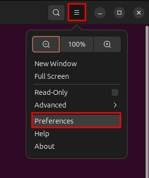
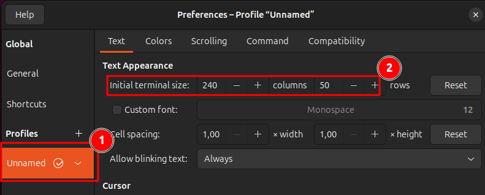

# Common Ubuntu Setup

## Install Apt Updates

Install updates of all your packages:

```bash
# fetch all the packages
sudo apt update
# list all the upgradable packages
sudo apt list -u
# update all packages
sudo apt upgrade -y
```

## Install Common Packages

```bash
sudo apt update
sudo apt install \
    bash-completion \
    build-essential \
    curl \
    git \
    git-lfs \
    htop \
    nano \
    ncdu \ 
    wget
```

## Configure Terminal

You can set the default terminal size to something bigger because the default terminal size is quite small. You can do this in the terminal app:




## ZSH

#### What is ZSH

**Zsh** (Z shell) is an extended version of the Bourne Shell (sh) with additional features like automatic cd, spelling correction, and support for plugins and themes. It is more powerful and customizable than Bash, offering advanced features such as improved auto-completion, syntax highlighting, and a more flexible command history

**Oh My Zsh** is a community-driven framework for managing your Zsh configuration. It comes bundled with thousands of helpful functions, plugins, and themes, making it easier to customize and enhance the terminal experience.

#### Install & Configure

Install zsh using the following command:

```bash
sudo apt update
sudo apt install zsh
```

Install Oh My Zsh:

```sh
sh -c "$(curl -fsSL https://raw.githubusercontent.com/ohmyzsh/ohmyzsh/master/tools/install.sh)"
```

Configure the `.zshrc`:

```sh
echo '\n# ZSH' >> ~/.zshrc && \
echo "export ZSH_THEME=\"eastwood\"" >> ~/.zshrc && \
echo "plugins=(git)" >> ~/.zshrc
```

## MS Edge

#### Install

- Install MS Edge from [here](https://www.microsoft.com/en-us/edge/download?form=MA13FJ).
- Edge mostly works better on Linux than Windows.

#### Use Web Apps

Web apps are applications that run in a web browser but can be installed on your Linux system as standalone apps using tools like Progressive Web Apps (PWAs). These apps offer a native-like experience, allowing you to access them directly from your desktop or application menu without needing to open a browser.

The following apps are recommended to install as a PWA:

- MS Teams: https://teams.microsoft.com/
- MS 365: https://www.office.com/?from=Homescreen
- MS Outlook: https://outlook.office.com/mail/
- Onedrive
- Azure Portal: https://portal.azure.com/

## Nvidia Drivers

#### Via the UI

- Open the `Software & Updates` App.
- Click on the `Additional Drivers` tab.
- Select the latest `Using NVIDIA driver metapackage from nvidia-driver-xxx (proprietary)` where `xxx` is the driver version. Just keep in mind, never select a driver with the following in the name:
  - open kernel
  - x.org / nouveau
  - server

## Install Docker

- You can find the official docker engine installation steps [here](https://docs.docker.com/engine/install/ubuntu/).
- Do **NOT** install Docker Desktop!
- Install the Nvidia Container toolkit from [here](https://docs.nvidia.com/datacenter/cloud-native/container-toolkit/latest/install-guide.html#installing-with-apt).

## Configure Git & Github

- Setup a Github account using [these](../github/joining_github/join_github.md) instructions.
- Configure SSH from [here](../git/ssh_vs_https.md).

## Install VS Code

- See further instructions [here](../ide/vscode/about_vscode.md).     
- Make sure to checkout the Common Settings!

## Common Problems

- No ethernet/wifi: `sudo apt install linux-firmware`
- `nvidia-smi` does not find a device. Try installing the open drivers.
  - For example, `sudo apt install nvidia-driver-570-open`